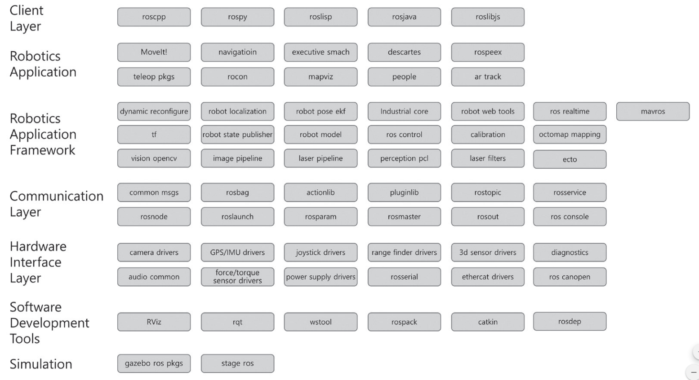
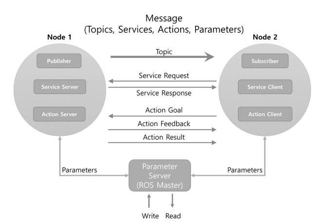
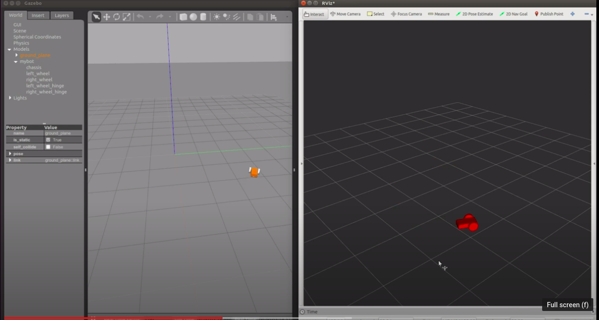
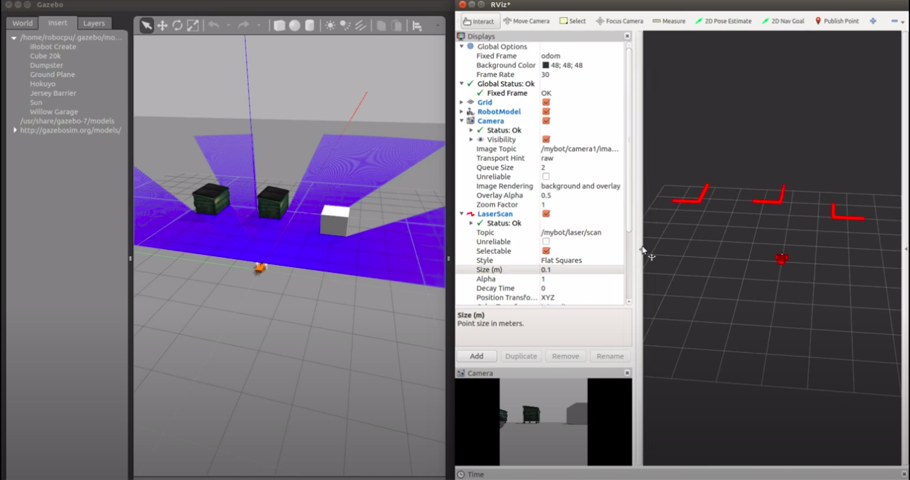
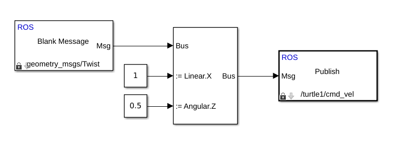

****************************
Robot Operating System
****************************

So, if you like we can focus on Turtlebot simulation. Something like:

#. What is ROS? Rosmaster, node, topic, message, subscriber, publisher, etc.
#. How to use these terms? The very first turtlebot tutorial, teleoperation with keyboard on the simulation, echo some topics, change the background...
#. But the simulation doesn't have any physical properties, we use Gazebo for that - Show them how to implement turtlebot. Or to provide a simple 2 wheel robot URDF as in the tutorial which I shared formerly so that they know what is URDF and how robots are modeled in a very simple way.
#. Even though you can code everything in Python/C++ as ROS node, sometimes you don't want to deal with every single details of everything and would like to use some other powerful tools like MATLAB. - Here is how you control your ROS side turtlebot with a publisher from MATLAB.

What is ROS?
=============
* **ROS**: "(Robot Operating System) is an open-source, meta-operating system for your robot. It provides the services you would expect from an operating system, including hardware abstraction, low-level device control, implementation of commonly-used functionality, message-passing between processes, and package management. It also provides tools and libraries for obtaining, building, writing, and running code across multiple computers." `ros.org <https://www.ros.org>`_

  * Meta operating system
  * Fundamental components

          Source: `ROS Robot Programming <https://www.pishrobot.com/wp-content/uploads/2018/02/ROS-robot-programming-book-by-turtlebo3-developers-EN.pdf>`_

* ROS versions

  .. figure:: ../_static/images/rosVersions.jpg
          :align: center

          Source: `ROS Versions <https://twitter.com/_theconstruct_/status/1168418352802516992>`_

  * Most useful resources

    * `ros.org <http://wiki.ros.org/>`_ and `ROS Tutorials <http://wiki.ros.org/ROS/Tutorials>`_
    * `ROS Robot Programming <https://www.pishrobot.com/wp-content/uploads/2018/02/ROS-robot-programming-book-by-turtlebo3-developers-EN.pdf>`_
    * `theconstructsim.com <https://www.theconstructsim.com/ros-for-beginners-how-to-learn-ros/>`_

Installation
=============
.. note::
   Only the first option is recommended but for those who don't want to install Ubuntu can use other alternatives.

* For Ubuntu users please follow the official guide `here <http://wiki.ros.org/ROS/Installation>`_
* For Windows users please follow the link to install `WSL <https://docs.microsoft.com/en-us/windows/wsl/install-win10>`_, `Visual Studio Code <https://code.visualstudio.com/download>`_ and for simplicity you can install `Visual Studio Code Remote - WSL Extension <https://code.visualstudio.com/docs/remote/wsl>`_.
* For browser-based ROS environment `ROSDS <https://auth.theconstructsim.com/auth/login/?next=/oidc/authorize/%3Fscope%3Dopenid%2Bprofile%2Bemail%26state%3D0U3HkB5WbPlLVhwsR10eFHXeWlbgStpy%26redirect_uri%3Dhttps%253A%252F%252Frds.theconstructsim.com%252Foidc%252Fcallback%252F%26response_type%3Dcode%26client_id%3D983516>`_.

ROS Ternimology
================
This section explains the most frequently used ROS terms. Use this section as a ROS glossary. 

ROS
~~~~
ROS provides standard operating system services such as hardware abstraction, device drivers, implementation of commonly used features including sensing, recognizing, mapping, motion planning, message passing between processes, package management, visualizers and libraries for development as well as debugging tools.

Master
~~~~~~
The master acts as a name server for node-to-node connections and message communication. The command roscore is used to run the master, and if you run the master, you can register the name of each node and get information when needed. The connection between nodes and message communication such as topics and services are impossible without the master.

Node
~~~~~
A node refers to the smallest unit of processor running in ROS. Think of it as one executable
program. ROS recommends creating one single node for each purpose, and it is recommended
to develop for easy reusability. For example, in case of mobile robots, the program to operate the
robot is broken down into specialized functions. Specialized node is used for each function such
as sensor drive, sensor data conversion, obstacle recognition, motor drive, encoder input, and
navigation.

Package
~~~~~~~~
A package is the basic unit of ROS. The ROS application is developed on a package basis, and the package contains either a configuration file to launch other packages or nodes. The package also contains all the files necessary for running the package, including ROS dependency libraries for running various processes, datasets, and configuration file. The number of official packages is about 2,500 for ROS Indigo as of July 2017and about 1,600 packages for ROS Kinetic. In addition, although there could be some redundancies, there are about 4,600 packages developed and released by users.

Metapackage
~~~~~~~~~~~~~
A metapackage is a set of packages that have a common purpose. For example, the Navigation
metapackage consists of 10 packages including AMCL, DWA, EKF, and map_server.

Message
~~~~~~~~
A node sends or receives data between nodes via a message. Messages are variables such as integer, floating point, and boolean. Nested message structure that contains another messages or an array of messages can be used in the message.

Topic
~~~~~~~
The topic is literally like a topic in a conversation. The publisher node first registers its topic
with the master and then starts publishing messages on a topic. Subscriber nodes that want to
receive the topic request information of the publisher node corresponding to the name of the
topic registered in the master. Based on this information, the subscriber node directly connects
to the publisher node to exchange messages as a topic.

Publish and Publisher
~~~~~~~~~~~~~~~~~~~~~~
The term ‘publish’ stands for the action of transmitting relative messages corresponding to the topic. The publisher node registers its own information and topic with the master, and sends a message to connected subscriber nodes that are interested in the same topic. The publisher is declared in the node and can be declared multiple times in one node.

Subscribe and Subscriber
~~~~~~~~~~~~~~~~~~~~~~~~~
The term ‘subscribe’ stands for the action of receiving relative messages corresponding to the topic. The subscriber node registers its own information and topic with the master, and receives publisher information that publishes relative topic from the master. Based on received publisher information, the subscriber node directly requests connection to the publisher node and receives messages from the connected publisher node. A subscriber is declared in the node and can be declared multiple times in one node.

The topic communication is an asynchronous communication which is based on publisher and subscriber, and it is useful to transfer certain data. Since the topic continuously transmits and receives stream of messages once connected, it is often used for sensors that must periodically transmit data. On the other hands, there is a need for synchronous communication with which request and response are used. Therefore, ROS provides a message synchronization method called ‘service’. A service consists of the service server that responds to requests and the service client that requests to respond. Unlike the topic, the service is a one-time message communication. When the request and response of the service is completed, the connection between two nodes is disconnected.

Service
~~~~~~~~
The service10 is synchronous bidirectional communication between the service client that requests a service regarding a particular task and the service server that is responsible for responding to requests.

Service Server
-----------------
The *service server* is a server in the service message communication that receives a request as an input and transmits a response as an output. Both request and response are in the form of messages. Upon the service request, the server performs the designated service and delivers the result to the service client as a response. The service server is implemented in the node that receives and executes a given request.

Service Client
-----------------
The *service client* is a client in the service message communication that requests service to the server and receives a response as an input. Both request and response are in the form of message. The client sends a request to the service server and receives the response. The service client is implemented in the node which requests specified command and receives results.

Action
~~~~~~~
The action11 is another message communication method used for an asynchronous bidirectional communication. Action is used where it takes longer time to respond after receiving a request and intermediate responses are required until the result is returned. The structure of action file is also similar to that of service. However, feedback data section for intermediate response is added along with goal and result data section which are represented as request and response in service respectively. There are action client that sets the goal of the action and action server that performs the action specified by the goal and returns feedback and result to the action client.

Action Server
--------------
The *action server* is in charge of receiving goal from the client and responding with feedback and result. Once the server receives goal from the client, it performs predefined process.

Action Client
--------------
The *action client* is in charge of transmitting the goal to the server and receives result or feedback data as inputs from the action server. The client delivers the goal to the action server, then receives corresponding result or feeedback, and transmits follow up instructions or cancel instruction.

Parameter
~~~~~~~~~~
The parameter in ROS refers to parameters used in the node. Think of it as ** *.ini**  configuration files in Windows  program. Default values are set in the parameter and can be read or written if necessary. In particular, it is very useful when configured values can be modified in real-time. For example, you can specify settings such as USB port number, camera calibration parameters, maximum and minimum values of the motor speed.

Parameter Server
------------------
When parameters are called in the package, they are registered with the parameter server which is loaded in the master.

Catkin
~~~~~~~~
The catkin refers to the build system of ROS. The build system basically uses CMake (Cross Platform Make), and the build environment is described in the ‘CMakeLists.txt’ file in the package folder. CMake was modified in ROS to create a ROS-specific build system. Catkin started the alpha test from ROS Fuerte and the core packages began to switch to Catkin in the ROS Groovy version. Catkin has been applied to most packages in the ROS Hydro version. The Catkin build system makes it easy to use ROS-related builds, package management, and dependencies among packages. If you are going to use ROS at this point, you should use Catkin instead of ROS build (rosbuild).

ROS Build
~~~~~~~~~~
The ROS build is the build system that was used before the Catkin build system. Although there are some users who still use it, this is reserved for compatibility of ROS, therefore, it is officially not recommended to use. If an old package that only supports the rosbuild must be used, we recommend using it after converting rosbuild to catkin.

roscore
~~~~~~~~
Roscore is the command that runs the ROS master. If multiple computers are within the same network, it can be run from another computer in the network. However, except for special case that supports multiple roscore, only one roscore should be running in the network. When ROS master is running, the URI address and port number assigned for ROS_MASTER_URI environment variables are used. If the user has not set the environment variable, the current local IP address is used as the URI address and port number 11311 is used which is a default port number for the master.

rosrun
~~~~~~~~
Rosrun is the basic execution command of ROS. It is used to run a single node in the package. The node uses the ROS_HOSTNAME environment variable stored in the computer on which the node is running as the URI address, and the port is set to an arbitrary unique value.

roslaunch
~~~~~~~~~~~
While rosrun is a command to execute a single node, roslaunch18 in contrast executes multiple nodes. It is a ROS command specialized in node execution with additional functions such as changing package parameters or node names, configuring namespace of nodes, setting ROS_ROOT and ROS_PACKAGE_PATH, and changing environment variables19 when executing nodes. roslaunch uses the ** *.launch ** file to define which nodes to be executed. The file is based on XML (Extensible Markup Language) and offers a variety of options in the form of XML tags.

bag
~~~~
The data from the ROS messages can be recorded. The file format used is called bag20, and ** *.bag ** is used as the file extension. In ROS, bag can be used to record messages and play them back when necessary to reproduce the environment when messages are recorded. For example, when performing a robot experiment using a sensor, sensor values are stored in the message form using the bag. This recorded message can be repeatedly loaded without performing the same test by playing the saved bag file. Record and play functions of rosbag are especially useful when developing an algorithm with frequent program modifications.

ROS Wiki
~~~~~~~~~
ROS Wiki is a basic description of ROS based on `Wiki <http://wiki.ros.org/>`_ that explains each package and the features provided by ROS. This Wiki page describes the basic usage of ROS, a brief description of each package, parameters used, author, license, homepage, repository, and tutorial. The ROS Wiki currently has more than 18,800 pages of content.

Repository
~~~~~~~~~~~~
An open package specifies repository in the Wiki page. The repository is a URL address on the web where the package is saved. The repository manages issues, development, downloads, and other features using version control systems such as svn, hg, and git. Many of currently available ROS packages are using GitHub21 as repositories for source code. In order to view the contents of the source code for each package, check the corresponding repository.

Graph
~~~~~~~~
The relationship between nodes, topics, publishers, and subscribers introduced above can be visualized as a graph. The graphical representation of message communication does not include the service as it only happens one time. The graph can be displayed by running the ‘rqt_graph’ node in the ‘rqt_graph’ package. There are two execution commands, ‘rqt_graph’ and ‘rosrun rqt_graph rqt_graph’.

Name
~~~~~~
Nodes, parameters, topics, and services all have names. These names are registered on the
master and searched by the name to transfer messages when using the parameters, topics, and
services of each node. Names are flexible because they can be changed when being executed,
and different names can be assigned when executing identical nodes, parameters, topics, and
services multiple times. Use of names makes ROS suitable for large-scale projects and complex
systems.

Client Library
~~~~~~~~~~~~~~~~
ROS provides development environments for various languages by using client library23 in order to reduce the dependency on the language used. The main client libraries are C++, Python, Lisp, and other languages such as Java, Lua, .NET, EusLisp, and R are also supported. For this purpose, client libraries such as roscpp, rospy, roslisp, rosjava, roslua, roscs, roseus, PhaROS, and rosR have been developed.

URI
~~~~
A URI (Uniform Resource Identifier) is a unique address that represents a resource on the Internet. The URI is one of basic components that enables interaction with Internet and is used as an identifier in the Internet protocol.

CMakeLists.txt
~~~~~~~~~~~~~~~~
Catkin, which is the build system of ROS, uses CMake by default. The build environment is specified in the ‘CMakeLists.txt’ file in each package folder.

package.xml
~~~~~~~~~~~~
An XML file contains package information that describes the package name, author, license, and dependent packages.

.. seealso::
   Not everything is included here. For more information and detailed explanation, please see `ROS Robot Programming <https://www.pishrobot.com/wp-content/uploads/2018/02/ROS-robot-programming-book-by-turtlebo3-developers-EN.pdf>`_ Chapter 4.1.

Message Communication in ROS
=============================
Here is the ROS message communication.

  
  Source: ROS Robot Programming *(Book)*

Hands On Activities
====================
We will first start running the built-in packages, execute nodes, publish and receive some topics. For these, we will follow the official ROS tutorials from the Wiki page.

#. `Understanding ROS Nodes <http://wiki.ros.org/ROS/Tutorials/UnderstandingNodes>`_
#. `Understanding ROS Topics <http://wiki.ros.org/ROS/Tutorials/UnderstandingTopics>`_
#. `Understanding ROS Services and Parameters <http://wiki.ros.org/ROS/Tutorials/UnderstandingServicesParams>`_

Create First Publisher/Subscriber
~~~~~~~~~~~~~~~~~~~~~~~~~~~~~~~~~~
We have learned the concepts of a publisher and a subscriber. In fact, one single node can be both publisher and subscriber at the same time, and this is more common than you may imagine. 

For now, we will seperate our publisher and subscriber in different scripts (nodes). Let's first create a *my_first_package* and place our nodes in it.

* To create a ROS package, we will follow the official `Creating a ROS Package <Creating a ROS Package>`_ tutorial (until section 5).

Now we are ready to create our first publisher of our first package. We will use Python language in today's lecture but it is possible to write your scripts in C++ also without any further hassle.

* `Writing a Simple Publisher and Subscriber <http://wiki.ros.org/ROS/Tutorials/WritingPublisherSubscriber%28python%29>`_

We are ready to play around now. Let's control the turtlesim with our own publisher. Here is the code for you. Don't celebrate it immediately for that you have the source code, there are some empty lines for you!

 .. literalinclude:: ../_static/scripts/turtlebotPublisher.py
       :language: Python

**Hint:** To find out which topic name you should publish your message, use :code:`rostopic list`.

.. seealso::
   Can you make your turtlesim to draw a square by using your own publisher?

Simulating Robots in ROS
==========================
In the ROS environment, there are 2 main simulation tools. `Rviz <http://wiki.ros.org/rviz>`_ and `Gazebo <http://gazebosim.org/tutorials?tut=ros_overview>`_. Even though they both are simulation tools, they diverge when it comes to usage. Rviz is more *visualization* purposes such that map creation, transfer function visualization, point cloud, image visualization etc. Gazebo, on the other hand, is used for physical testing. Despite the fact that it is possible to test sensor readings on Rviz as well, it is not possible to test collisions in Rviz; you need Gazebo (or another physics engine embedded simulation tools.

          Source: moorerobots.com

.. note::
   Gazebo is a standalone simulation tool with its own physics engine. It does not require ROS to run.

Rviz Introduction
~~~~~~~~~~~~~~~~~~
The original tutorial is `here <http://wiki.ros.org/tf/Tutorials/Introduction%20to%20tf>`_. Let's modify this to understand Rviz elements a bit more. First start the node with two turtles with the following command: :code:`roslaunch turtle_tf turtle_tf_demo.launch`.

Start Rviz: :code:`rosrun rviz rviz`.

As you see, there is no element on the left toolbar. First add the :code:`/world` frame. Also add the TF element.

Click on the terminal again, use your arrow keys to move your turtle and observe the TF poses on Rviz.

Gazebo Introduction
~~~~~~~~~~~~~~~~~~~~
Gazebo is the most used simulator in ROS. It has integrated physics rules like gravity, colision, light distribution with reflection and refraction properties, mass and inertia etc. Now, we will see how to set the Gazebo for a very basic usage.

.. warning::
   Before moving on, I would like you all to have the same folder organization as shown in the figure. This is important for you to follow the rest of the tutorial easily. Although such an organization is not necessarry for ROS system particularly, this is the accepted/official way of organizing ROS packages.

   .. figure:: ../_static/images/folders.png
          :align: center

First, let's create an empty world under the /world folder.

.. literalinclude:: ../_static/scripts/empty_world.world
      :language: xml
      :caption: empty_world.world

Secondly, create a launch file under /launch folder to run Gazebo and import our empty world.

.. literalinclude:: ../_static/scripts/my_world_gazebo.launch
      :language: xml
      :caption: my_world_gazebo.launch

We can add some items by just adding items as we included the *sun* and the *ground plane* into our world file. There are many ready-to-use models in the official `gazebo-models repository <https://github.com/osrf/gazebo_models>`_. Now, choose a model and as in the following code.

.. code-block:: xml

   <!-- Add an object -->
	<include>
	  <uri>model://postbox</uri>
	</include>

Also you can change the position and orientation of any object which you have added with the :code:`<pose>x y z roll pitch yaw</pose>` tag.

URDF
-----
Unified Robot Description Format. It is used to describe the robot model. It contains links, joints and basic material information of each part of the robot. `Here <http://wiki.ros.org/urdf/Tutorials/Building%20a%20Visual%20Robot%20Model%20with%20URDF%20from%20Scratch>`_ is the R2D2 model written in URDF!

All the elements that you can use in an URDF file are `these. <http://wiki.ros.org/urdf/XML/robot>`_ A simple URDF file looks like this. Let's first understand it line by line.

 .. literalinclude:: ../_static/scripts/simplexacro.xacro
       :language: xml

URDF in RViz
-------------

 .. literalinclude:: ../_static/scripts/my_robot.xacro
       :language: xml
       :caption: beginners_tutorials/urdf/my_robot.xacro

 .. literalinclude:: ../_static/scripts/my_robot_rviz.launch
       :language: xml
       :caption: beginners_tutorials/launch/my_robot_rviz.launch

URDF in Gazebo
----------------

URDF files are able to be used in Gazebo by including mass, inertia, joint efforts, joint limits etc properties of the links and joint. In fact, Gazebo simulator does not use the URDF files directly. The file format in which Gazebo uses is SDF (Simulation Description Format). The main reason is that the URDF files are lacking many features and have not been updated to deal with the evolving needs of robotics. URDF can only specify the kinematic and dynamic properties of a single robot in isolation. URDF can not specify the pose of the robot itself within a world. It is also not a universal description format since it cannot specify joint loops (parallel linkages), and it lacks friction and other properties. Additionally, it cannot specify things that are not robots, such as lights, heightmaps, etc.

However, at this moment, there is no need to frustrate with a new file format than URDF yet it is nice to know this fact. For more detailed information, you can `read this <http://gazebosim.org/tutorials?tut=ros_urdf>`_.

Xacro: beginners_tutorials/urdf/mybot/mybot.xacro :code:`git clone -b base https://github.com/richardw05/mybot_ws.git`

 .. literalinclude:: ../_static/scripts/my_robot_gazebo.launch
       :language: xml
       :caption: beginners_tutorials/launch/my_robot_gazebo.launch

*This tutorial is based on the* `Moore Robots <http://www.moorerobots.com/blog>`_ *tutorials. They provide a series of robot modelling/simulation/navigation tutorial. It can be a bit confusing for the beginners but I believe that they are very useful for those who would like to use ROS in their term projects.* `Here <https://www.youtube.com/watch?v=8ckSl4MbZLg&list=PLTEmcYHVE7dPWixFnzkd68jPjwGzxHjUG>`_ * is the youtube tutorial of Moore robots.*

Adding Sensors to the Gazebo Model (part 2)
---------------------------------------------
Adding scanner and some obstacles on our 2 wheel robot. It is going to look like this:

This part is going to be a homework. The tutorial is `here <https://www.youtube.com/watch?v=EZ3MYf24c6Y&list=PLTEmcYHVE7dPWixFnzkd68jPjwGzxHjUG&index=2&ab_channel=RichardWang>`_.

ROS with Matlab
~~~~~~~~~~~~~~~~~
We have seen that ROS is a very powefull tool which allows us to use many predefined packages including various robots' packages, various algorithms, sensor drivers etc. On the other hand, we have another powerful in our hands for which mostly we use signal processing, modelling, in control process. It would be cool if we used them together. 

Recently Matlab included **ROS** under its Robotics Toolbox which enables the ROS environment accessible via Matlab. Now, we are going to set our Matlab to control turtlesim which we started from our ROS.

Beneficial tutorials:

#. `ROS Toolbox <https://se.mathworks.com/help/ros/index.html?s_tid=CRUX_lftnav>`_

As we have :code:`roscore` on ROS, there is an equivalent on Matlab as :code:`rosinit` to start the ROS master in the network. There is a slight difference of starting the ROS master between using :code:`roscore` and :code:`rosinit`. If you type :code:`rosnode list`, you will see a global node which was started by Matlab but you won't see :code:`\rosout` (as we are used to see). In usage, there is not a significant difference right now since we are not going to connect a real robot. Just keep in mind that if you need to include more modules/robots/PC in the same ROS network, they should be connected to the same ROS master. If you want to initialize your ROS master on a specific address you should specify it :code:`rosinit('192.168.17.157')`.

Since we successfully ran the ros master, we can create the first publisher. There are two ways of doing it:

#. Via Simulink
#. Via Matlab Script

Via Simulink
----------------
This is the most intuitive and the easiest way of creating a ROS publisher using Matlab. Using Simulink, please create the following model.

.. note::
   I will show you the communication between two environments (Ubuntu and Matlab). For those who use ROSDS, this activity won't work because ROSDS works on a cloud PC which is not connected the same network as our personal computer. 

   Since ROSDS users do not have any preinstalled ROS distribution, they cannot run :code:`turtlesim` nodes. On Matlab, there is a similar tutorial simulation. I will show this part after I am done with the *turtlesim* tutorial.

**On turtlesim:**

* So, let's start the tf example of two turtles: :code:`roslaunch turtle_tf turtle_tf_demo.launch`.
* Check the available ROS topics: :code:`rostopic list`.
* The topic in which we would like to publish is: :code:`/turtle1/cmd_vel`.

**On ExampleHelperSimulinkRobotROS:**

* After initializing the ROS master, you need to type :code:`sim = ExampleHelperSimulinkRobotROS;` on the Matlab command window.
* Check the available ROS topics: :code:`rostopic list`.
* The topic in which we would like to publish is: :code:`/mobile_base/commands/velocity`.
* Set the simulink publisher link to :code:`/mobile_base/commands/velocity`.

Via Matlab Script
-------------------
.. note::
   You can write this code directly on the Command Window also.

**On turtlesim:**
Copy this piece of code into a new script which you created under the work directory of Matlab.

 .. literalinclude:: ../_static/scripts/turtlesim_control_script.m
       :language: Python

**On ExampleHelperSimulinkRobotROS:**

* Chance the :code:`/turtle1/cmd_vel` into :code:`/mobile_base/commands/velocity`.

