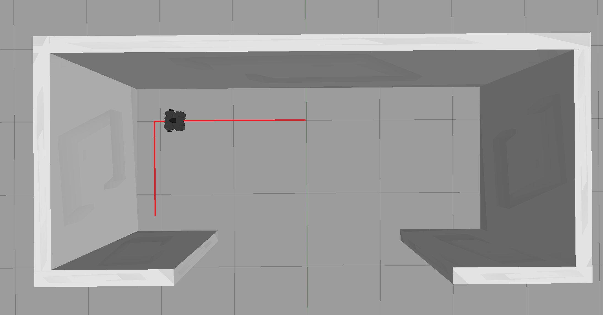
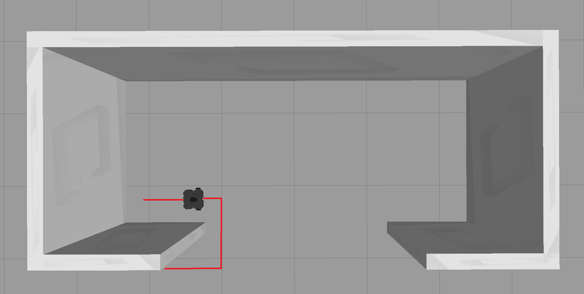
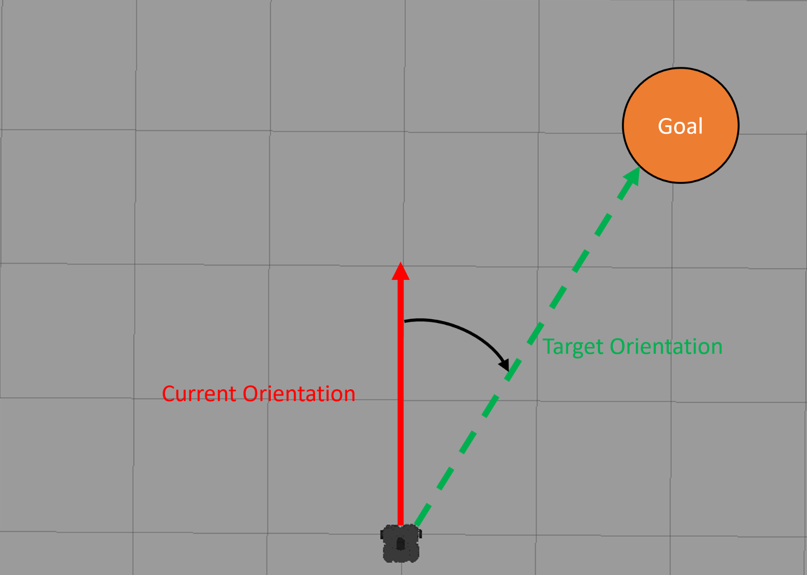
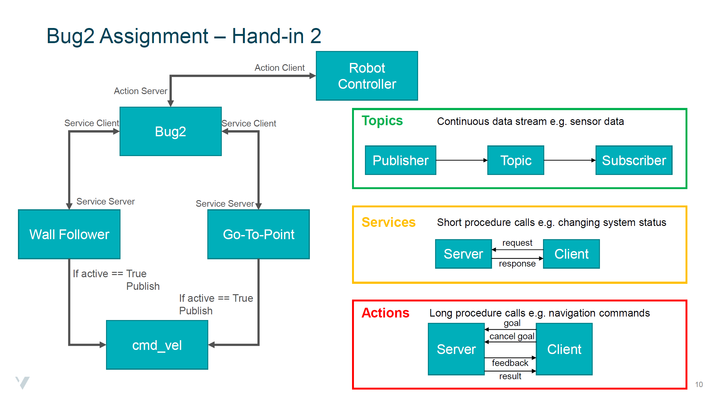

.. _ros_bug2_exercise:

***************************************************
[Assignment] Bug2 Navigation Algorithm
***************************************************

In this assignment you will create a controller which uses the Bug2 algorithm for navigating a Turtlebot to a target destination. The goal of this exercise is for you to be able to implement a navigation algorithm and learn to use the different communication patterns available in ROS. The hand-in of this assignment is split in two:

#. Implement a wall follower and a go-to-point controller which use ROS topics for communicating with the robot. Both of the controllers should also run a Service server which allows for enabling/dissabeling them.
#. Implement a bug2 controller which uses the already established wall follower and go-to-point controllers. The bug2 controller should enable and disable the wall follower and go-to-point controllers using their ROS services. For sending a target location to the bug2 controller an action server should be created.

Tutorials on the different ROS communication patterns can be found in the Media Gallery inside the playlist **ROS COMMUNICATION PATTERNS** and the accompanying website :ref:`ros_communication`.

Setup Process
==============================================
For setting up the assignment follow these steps:

* Download the package from `here <https://hvl365.sharepoint.com/:f:/s/RobotikkUndervisningHVL/Enrwaes3-StMpUmWQ6EXNMgB3bnecXjSRwwHYvVniw06mg?e=k8MiH6>`_.
* Extract the folder inside the .zip file and copy it in the **src** folder of your **catkin_ws**
* In a terminal navigate to the **catkin_ws** and run *catkin_make*, *source devel/setup.bash* and *rospack profile*
* Make the .py files in the src folder of the ROS package executable

The project contains one launch file which starts up the gazebo world and rviz. For running the controller python scripts either use rosrun or create your own launch file for them.

Hand-in 1:
==============================================
In the first hand-in you will create a wall follower and a go-to-point controller.

Wall Follower
----------------
The wall follower should find a wall and then drive in parallel to it, using the LiDAR sensor topic (/scan) to ensure the robot is not straying off and to reorient itself when hitting a corner:

A special case you will also need to take care off is when the wall suddenly stops you need to program a behavior which moves the robot to the other side of the wall so that it can continue with the normal wall following:

For moving the robot create a publisher for the /cmd_vel topic. Inside the control loop use a boolean variable to decide if the velocity command is published or not. Create a ROS service server which changes sets the state of the variable (either True or False). For this you can either use the standard service message *std_srvs/SetBool* or create your own custom message. In canvas under **Emnets mediefiler** you will find a playlist called **ROS COMMUNICATION PATTERNS** which contain tutorials on how to implement/work with the different communication patterns in python. For help on ROS services watch the videos **Simple Service Implementation** and **Creating Custom Services**.

Go-To-Point
----------------

The go-to-point algorithm takes as input a target position. It then turns the robot until it faces that target and starts moving forward. While moving straight the controller needs to make sure that the robot doesn't stray off by constantly correcting the direction if necessary. To get the position and orientation of the robot subscribe to the odometry sensor topic (/odom). The orientation is given in quaternions which is a mathematical number system used to describe orientations in a 3D space. Since it is out of the scope of this course to explain how it works you can use the following callback function for the odometry topic which extracts the position (**self.robot_pos**) of the robot and the orientation around the z axis (**self.robot_orientation**).

::

  from tf import transformations

  def odom_callback(self, msg):
      self.robot_pos = msg.pose.pose.position

      quaternion = (
          msg.pose.pose.orientation.x,
          msg.pose.pose.orientation.y,
          msg.pose.pose.orientation.z,
          msg.pose.pose.orientation.w)
      euler = transformations.euler_from_quaternion(quaternion)

      self.robot_orientation = euler[2]

Similar to the wall follower, the go-to-point controller also uses the /cmd_vel topic for moving the robot. It also requires a ROS service server but with a custom message with the following structure:

::

  bool move_switch
  geometry_msgs/Point target_position
  ---
  bool success

Hand-in 2:
==============================================
For the second hand-in you are required to create a **bug2** controller using the previously created **wall-follower** and **go-to-point** controllers. **You can also download the files which have a functioning logic already implemented** `here <https://hvl365.sharepoint.com/:f:/s/RobotikkUndervisningHVL/EjF_VTiPUe9AvySi7ufooSMBAUFYm3dgjlr3Yj2gYz7P6A?e=y9z6hY>`_. The bug2 algorithm by default uses **go-to-point** to get to the target position as fast as possible. If the robot encounters a wall on the way, the algorithm switches to **wall following**. Once it encounters a position on the initially calculated straight line to the goal which is closer to the target then when it left the line, it reverts back into the **go-to-point** behavior. For switching between wall following and go-to-point behavior use the previously created ROS services.

.. figure:: ../../_static/images/ros/bug2_algorithm.jpg
          :align: center

The bug2 controller should also host an **action server** which allows other ROS packages to send a target position for the robot. For help on how to implement an action server in python watch the video **Simple Action Implementation** in the **ROS Communications Patterns** playlist on canvas. The action message structure should look like this:

::

  geometry_msgs/Point target_position
  ---
  geometry_msgs/Point base_position
  ---
  geometry_msgs/Point current_position

The overall communication structure was discussed in the Lecture and is visualized in the following Figure. **Before you hand in your assignment make sure you have the following implemented:**

* The publishers/subscribers to relevant topics for bug2, wall follower and go-to-point
* A ROS Service Server for both wall follower and go-to-point. The wall follower Server uses *std_srvs/SetBool* message structure. The go-to-point Server uses a custom message structure given above.
* Two ROS Service Clients in the bug2 program connencted to the servers from wall follower and go-to-point.
* An Action Server in the bug2 program with a custom message structure given above.
* A robot controller program that has an Action Client connected to the bug2 Action Server.

