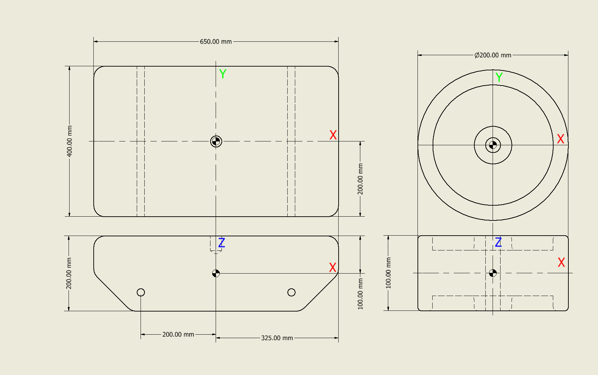
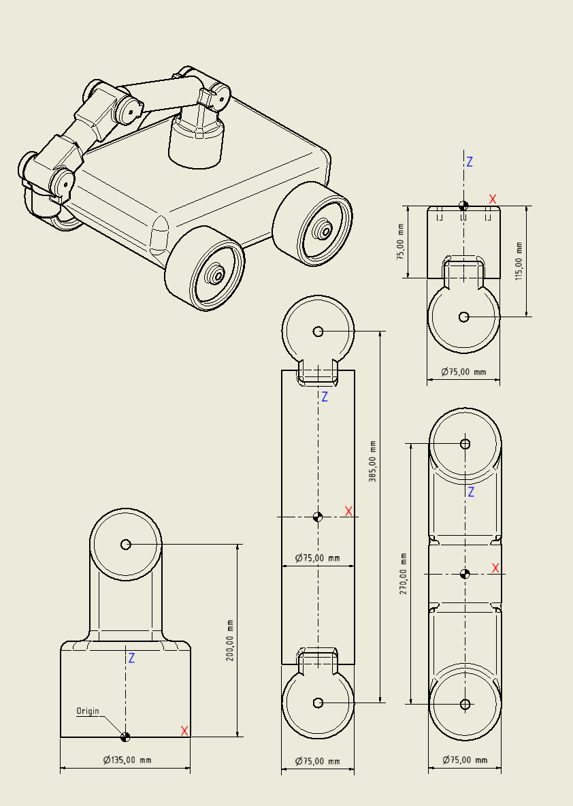

.. _ros_custom_robot:

******************************************
ROS Build a Custom Robot
******************************************

In this Chapter we will look at how to build a gazebo model of a robot given the mechanical design. The following topics will be covered:
 
 * Building up the model in Gazebo
 * Adding a ROS control interface to the model
 
Building a Gazebo Model
=========================
A model in Gazebo is made out of links which are connected through joints. Since this is a ROS lecture we use URDF files to declare the model. There are other ways of doing it, which will not be covered. **In general it is important to notice that all distances are generally in** `meters <https://en.wikipedia.org/wiki/Metre>`_ **and all angles in** `radian <https://en.wikipedia.org/wiki/Radian>`_.

Link definition
---------------------
urdf link definition: http://wiki.ros.org/urdf/XML/link

Box
~~~~~~~~
.. literalinclude:: ../../_static/scripts/build_custom_robot/link_box.urdf.xacro
       :language: XML
       :caption: xacro link for box object

Cylinder
~~~~~~~~~~
.. literalinclude:: ../../_static/scripts/build_custom_robot/link_cylinder.urdf.xacro
       :language: XML
       :caption: xacro link for cylinder object
       
Sphere
~~~~~~~~~~
.. literalinclude:: ../../_static/scripts/build_custom_robot/link_sphere.urdf.xacro
       :language: XML
       :caption: xacro link for sphere object

Mesh
~~~~~~~~~~
.. literalinclude:: ../../_static/scripts/build_custom_robot/mesh_geometry.urdf.xacro
       :language: XML
       :caption: using mesh files for link geometry

Inertial Parameters
---------------------
gazebo tutorial on calculation inertia parameters: http://gazebosim.org/tutorials?tut=inertia
automated inertia parameters calculator from mesh file (mesh cleaner): https://www.hamzamerzic.info/mesh_cleaner/
formulas for calculating simple shape inertia parameters: https://en.wikipedia.org/wiki/List_of_moments_of_inertia

Joint definition
---------------------
urdf joint definition: http://wiki.ros.org/urdf/XML/joint

.. literalinclude:: ../../_static/scripts/build_custom_robot/joint_continuous.urdf.xacro
       :language: XML
       :caption: defining a continuous joint in xacro
       
.. literalinclude:: ../../_static/scripts/build_custom_robot/joint_revolute.urdf.xacro
       :language: XML
       :caption: defining a revolute joint in xacro 
       
.. literalinclude:: ../../_static/scripts/build_custom_robot/joint_prismatic.urdf.xacro
       :language: XML
       :caption: defining a prismatic joint in xacro    
       
.. literalinclude:: ../../_static/scripts/build_custom_robot/joint_fixed.urdf.xacro
       :language: XML
       :caption: defining a fixed joint in xacro       

Exercise
---------------------
Download the ROS package used for the exercise from this `link <https://hvl365.sharepoint.com/:u:/s/RobotikkUndervisningHVL/Ea8kb_mYnChEgkMMtsu2ADsBUF5L2bPqn_ZkFg1B4gEjYQ?e=P1R1tu>`_. After unzipping it, copy it to the VM in catkin_ws/src/. Run the following commands in a terminal window:

::

 cd ~/catking_ws/
 catkin_make

          
   
