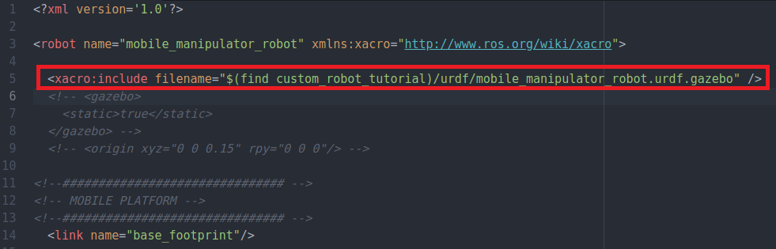
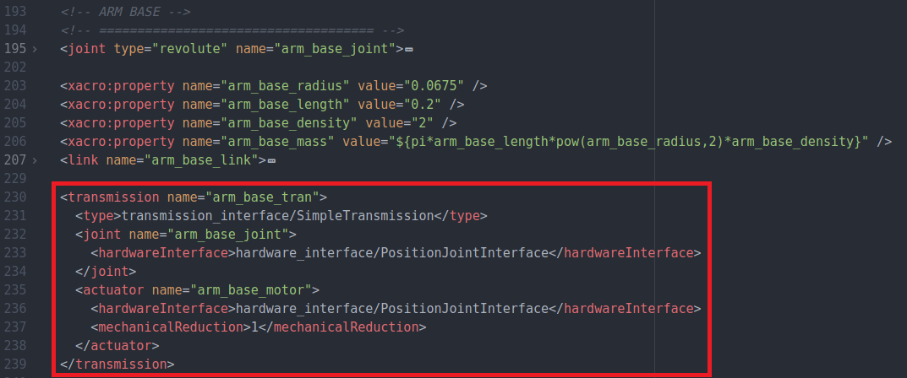
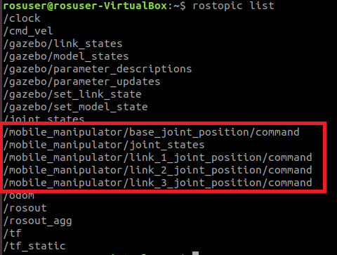

.. _ros_custom_robot:

******************************************
ROS Build a Custom Robot
******************************************

In this Chapter we will look at how to build a gazebo model of a robot given the mechanical design. The following topics will be covered:
 
 * Building up the model in Gazebo
 * Adding a ROS control interface to the model
 
Building a Gazebo Model
=========================
A model in Gazebo is made of links which are connected through joints. Since this is a ROS lecture, we use URDF files to declare the model. There are other ways of doing it, which will not be covered. **In general it is important to notice that all distances are generally in** `meters <https://en.wikipedia.org/wiki/Metre>`_ **and all angles in** `radian <https://en.wikipedia.org/wiki/Radian>`_.

Link definition
---------------------
The official documentation of how to define a link in urdf can be found `here <http://wiki.ros.org/urdf/XML/link>`_.

Box
~~~~~~~~
.. literalinclude:: ../../_static/scripts/build_custom_robot/link_box.urdf.xacro
       :language: XML
       :caption: xacro link for box object

Cylinder
~~~~~~~~~~
.. literalinclude:: ../../_static/scripts/build_custom_robot/link_cylinder.urdf.xacro
       :language: XML
       :caption: xacro link for cylinder object
       
Sphere
~~~~~~~~~~
.. literalinclude:: ../../_static/scripts/build_custom_robot/link_sphere.urdf.xacro
       :language: XML
       :caption: xacro link for sphere object

Mesh
~~~~~~~~~~
.. literalinclude:: ../../_static/scripts/build_custom_robot/mesh_geometry.urdf.xacro
       :language: XML
       :caption: using mesh files for link geometry

Inertial Parameters
---------------------
An accurate simulation requires accurate dynamic properties of the links. These are defined by the inertial parameters. An official guide on the Gazebo website can be found `here <http://gazebosim.org/tutorials?tut=inertia>`_. An online tool (mesh cleaner) to calculate the inertial parameters for mesh files automatically can be found `here <https://www.hamzamerzic.info/mesh_cleaner/>`_. When using simple shapes, the previous example code for the different links automatically calculates the inertial parameters assuming you use the defined variables. A list of formulas to calculate the inertial parameters for simple shapes can be found `here <https://en.wikipedia.org/wiki/List_of_moments_of_inertia>`_. 

**Make sure the center of mass is in the accurate location.** For simple shapes it is in the center of the link, which means, as long as the <origin> inside the <intertail> tag is the same as the <origin> in the <collision> tag it should be correct.

Joint definition
---------------------
The official documentation of how to define a joint in urdf can be found `here <http://wiki.ros.org/urdf/XML/joint>`_. Some important parts of the joint definition are the following:

 * **<axis>:** defines which axis is used by the joint for movement.
 * **<limit>**
   
      * **effort** maximum torque/force measured in [Nm]
      * **velocity** maximum speed measured in [m/s] for primatic joints and [rad/s] for revolute joints
      * **lower** minimum allowed joint angle/position measured in [m] for prismatic joints and [rad] for revolute joints.
      * **upper** maximum allowed joint angle/position
   

Continuous Joint
~~~~~~~~~~~~~~~~~~
Continuous joints rotate around the defined axis (1 degree of freedom).

.. literalinclude:: ../../_static/scripts/build_custom_robot/joint_continuous.urdf.xacro
       :language: XML
       :caption: defining a continuous joint in xacro
       
Revolute Joint
~~~~~~~~~~~~~~~~~~
Revolute joints also rotate around the defined axis (1 degree of freedom) similar to continuous joints but have a defined minimum and maximum joint angle in [rad].

.. literalinclude:: ../../_static/scripts/build_custom_robot/joint_revolute.urdf.xacro
       :language: XML
       :caption: defining a revolute joint in xacro 
       
Prismatic Joint
~~~~~~~~~~~~~~~~~~
Prismatic joints move along the defined axis (1 degree of freedom) and have a minimum and maximum joint position definedin [m].

.. literalinclude:: ../../_static/scripts/build_custom_robot/joint_prismatic.urdf.xacro
       :language: XML
       :caption: defining a prismatic joint in xacro    
       
Fixed Joint
~~~~~~~~~~~~~~~~~~
Fixed joints are not really joints because all degrees of freedom are blocked.

.. literalinclude:: ../../_static/scripts/build_custom_robot/joint_fixed.urdf.xacro
       :language: XML
       :caption: defining a fixed joint in xacro       

.. _Custom_Robot_Exercise:

Exercise
---------------------
Download the ROS package used for the exercise from this `link <https://hvl365.sharepoint.com/:u:/s/RobotikkUndervisningHVL/Ea8kb_mYnChEgkMMtsu2ADsBUF5L2bPqn_ZkFg1B4gEjYQ?e=P1R1tu>`_. After unzipping it, copy it to the VM in catkin_ws/src/. Run the following commands in a terminal window:

::

 cd ~/catkin_ws/
 catkin_make

Copy the following code into the file "mobile_manipulator_robot.urdf.xacro" located in the "urdf" folder of the ROS package:

.. literalinclude:: ../../_static/scripts/build_custom_robot/mobile_manipulator_robot_init.urdf.xacro
       :language: XML
       :caption: mobile_manipulator_robot.urdf.xarco located in the urdf file 

To start the Gazebo world use the following command in the terminal:

::

 roslaunch custom_robot_tutorial mobile_manipulator.launch
 
To spawn the robot in the existing Gazebo world use the following terminal command:

::

 roslaunch custom_robot_tutorial robot_spawn.launch
 
Start adding the missing 3 wheels to the robot model by modifying the "mobile_manipulator_robot.urdf.xacro" file. Where to place the wheels can be deducted from the following mechanical drawings:

.. figure:: ../../_static/scripts/build_custom_robot/mobile_robot_plan_2.png
          :align: center   

.. figure:: ../../_static/scripts/build_custom_robot/robot_arm_plan_2.png
          :align: center
          
Once you finished with adding all the wheels to the mobile platform, copy the following code into the "mobile_manipulator_robot.urdf.xacro" file just **before** the </robot> tag at the end of the file:

.. literalinclude:: ../../_static/scripts/build_custom_robot/mobile_manipulator_robot_arm_init.urdf.xacro
       :language: XML
       :caption: mobile_manipulator_robot.urdf.xarco located in the urdf file 
 
 
Controlling the Gazebo Model
=============================
In the previous Exercise a simulation model for gazebo of a custom robot has been built. This section will continue from that point, by going through the process of adding a controller interface which makes the model movable through ROS. The completed URDF model file (mobile_manipulator_robot.urdf.xacro) can be downloaded `here <https://hvl365.sharepoint.com/:u:/s/RobotikkUndervisningHVL/EVZzUx8PRMJKsVX8LpI3dIABQm-ga3slvF9rNK4IDNBfyg?e=aY81dO>`_. All gazebo plugins will be defined in the **mobile_manipulator_robot.urdf.gazebo** file. Therefore, we must refence it in our xacro file by adding the following code as shown in the image below: 

.. literalinclude:: ../../_static/scripts/build_custom_robot/add_gazebo_file.urdf.xacro
       :language: XML
       :caption: referencing the .urdf.gazebo file in our urdf.xacro file
       

          
The basic structure of the **mobile_manipulator_robot.urdf.gazebo** file is as follows:

.. literalinclude:: ../../_static/scripts/build_custom_robot/basic_structure.urdf.gazebo
       :language: XML
       :caption: basic structure .urdf.gazebo file

Mobile platform
---------------------
For mobile platforms with two or four wheels, gazebo has predefined plugins. Both plugins subscribe to the "cmd_vel" ROS topic which can then be used to move the mobile robot. More information on how to publish on the "cmd_vel" topic can be found in subsection :ref:`Controlling_Mobile_Platform`.

Differential Drive (two wheels)
~~~~~~~~~~~~~~~~~~~~~~~~~~~~~~~~~~
The gazebo plugin for two wheeled robots is called "libgazebo_ros_diff_drive.so" and can be used by copying the following code into your **mobile_manipulator_robot.urdf.gazebo** file: 

.. literalinclude:: ../../_static/scripts/build_custom_robot/diff_drive.urdf.gazebo
       :language: XML
       :caption: example code for differential drive controller plugin
       
The following parameters need to be ajusted for the plugin to work:

 * **<robotBaseFrame>:** is the name of the link which is used as the base or origin frame of the robot.
 * **<leftJoint>:** is the name of the joint which turns the left wheel, as it has been defined in your urdf.xacro file.
 * **<rightJoint>:** is the name of the joint which turns the right wheel, as it has been defined in your urdf.xacro file.
 * **<wheelSeparation>:** is the distance between the center of the left wheel to the center of the right wheel in meters.
 * **<wheelDiameter>:** is the diameter of the wheels in meters.
       
Skid Steer Drive (four wheels)
~~~~~~~~~~~~~~~~~~~~~~~~~~~~~~~~~~ 
The gazebo plugin for four wheeled robots is called "libgazebo_ros_skid_steer_drive.so" and can be used by copying the following code into your **mobile_manipulator_robot.urdf.gazebo** file: 

.. literalinclude:: ../../_static/scripts/build_custom_robot/skid_steer_drive.urdf.gazebo
       :language: XML
       :caption: example code for skid steer drive controller plugin

The parameters which need adjusting are similar to the ones from the differential drive plugin, with the exception of having to reference four wheel joint names instead of two.

.. _Controlling_Mobile_Platform:

Controlling the Mobile Platform
~~~~~~~~~~~~~~~~~~~~~~~~~~~~~~~~~~ 
Both previously mentioned gazebo plugins create a controller which subscribes to the "cmd_vel" topic. To check if the control works, you can use a terminal command to publish on that same topic. **Make sure that the project is running by using the roslaunch commands shown in subsection** :ref:`Custom_Robot_Exercise`. Copy the following command in a terminal and then use the *tabulator* key three times to autocomplete the message. Adjust the values as wanted before pressing *enter*.

::

 rostopic pub /cmd_vel

To learn how to control the robot with MATLAB go to section :ref:`MATLAB_ROS_Control`

.. _ROS_robot_arm:

Robot Arm
---------------------
Making the robot arm controllable is a bit more work than with the mobile platform. First we also add a gazebo plugin to our **mobile_manipulator_robot.urdf.gazebo** file:

.. literalinclude:: ../../_static/scripts/build_custom_robot/gazebo_ros_control.urdf.gazebo
       :language: XML
       :caption: example code for ros control plugin

where ROBOT_NAME should be exchanged with the name you want to give your robot. The name should match with the robot name used in your mobile_manipulator_robot.urdf.xacro file as well as with the robot name used in later configurations.

Transmission
~~~~~~~~~~~~~~~~~~~~~~~~~~~~~~~~~~ 
In order to control the joint of the robot arm we have to define what type of transmission we want to use for each motorized joint by adding the following example code in your **mobile_manipulator_robot.urdf.xacro** file positioned after the joint and link definition as visualized in the image below:

.. literalinclude:: ../../_static/scripts/build_custom_robot/joint_position_transmission.urdf.xacro
       :language: XML
       :caption: example code for a join position transmission definition
       

It must be stated, that this example implements a transmission with a joint position controller. More information on the `transmission definition <http://wiki.ros.org/urdf/XML/Transmission>`_ and the different `controller types <http://wiki.ros.org/ros_control#Controllers>`_ can be found on the official ROS website. 

ROS parameter definition
~~~~~~~~~~~~~~~~~~~~~~~~~~
The ROS controller_manager package needs the transmission joints defined as ROS parameters which we do in the **joint_controller.yaml** file which is located in the config folder. Copy the following example code in that file:

.. literalinclude:: ../../_static/scripts/build_custom_robot/joint_controller.yaml
       :language: XML
       :caption: example code joint_controller.yaml file

Replace ROBOT_NAME with the name you already used in the beginning of the :ref:`ROS_robot_arm` section. CONTROLLER_NAME can be chosen freely but needs to match the launch file definition later in this section. JOINT_NAME needs to be the name of the joint defined in your mobile_manipulator_robot.urdf.xacro file. Add as many controllers as you have motorized joints.

Finally we need to add the following code to our **robot_spawn.launch** file to include the controller_manager package during startup. Make sure to change ROBOT_NAME and CONTROLLER_NAME to the appropriate values. And again, depending on how many motorized joints you have, you might need to add extra CONTROLLER_NAME references.

.. literalinclude:: ../../_static/scripts/build_custom_robot/robot_controller.launch
       :language: XML

Controlling the robot arm
~~~~~~~~~~~~~~~~~~~~~~~~~~~~~~
The controller_manager subscribes to one topic for each perviously defined motorized joint. The topic names have the following syntax:

::

  /ROBOT_NAME/CONTROLLER_NAME/command

An example of the topic names used in my example is shown in the following image:
  

 
To test if the control of the robot arm is working, you can use the following terminal command. After copying the command in a terminal, change the TOPIC_NAME according to the syntax previously explained press the tabulator key a view times to autocomplete the message.

::
  
  rostopic pub TOPIC_NAME

.. _MATLAB_ROS_Control: 
 
Matlab Controller
---------------------
This section will go into detail on how to control the Gazebo model with a MATLAB script.

Kinematic Model
~~~~~~~~~~~~~~~~~~~~~~~~~~~~~~
The following code creates a standard kinematics representation of the robot arm, where "T" stands for translation and "R" stands for rotation. "x", "y" and "z" define that the rotation or translation is around/along that axis of the base frame. The last code line plots the robot in the state with the defined joint angles.

.. literalinclude:: ../../_static/scripts/build_custom_robot/robot_normal.m
       :language: MATLAB

DH Parameters 
~~~~~~~~~~~~~~~~~~~~~~~~~~~~~~
Another way of describing the kinematic model of a robot is to use the Denavit-Hartenberg Parameters. The following code shows an example of the syntax used to do this in MATLAB: 

.. literalinclude:: ../../_static/scripts/build_custom_robot/robot_dh.m
       :language: MATLAB

Forward/Inverse Kinematics
~~~~~~~~~~~~~~~~~~~~~~~~~~~~~~
The following code lines give an example of how to compute the forward and inverse kinematics for the previously created DH model of the robot. The first line computes the transformation matrix given the joint angles of each motorized joint. The second line calculates the transformation matrix given the end-effector position and orientation. The third line computes the joint angles given one of the two previous transformation matrices. 

.. literalinclude:: ../../_static/scripts/build_custom_robot/robot_kinematics.m
       :language: MATLAB

ROS in MATLAB
~~~~~~~~~~~~~~~~~~~~~~~~~~~~~~
ROS allows different programs to communicate with each other. The following code gives an example of a ROS node written in MATLAB which subscribes to the Odometry topic from the robot and publishes movement commands to the mobile platform as well as the joints of the robot arm:

.. literalinclude:: ../../_static/scripts/build_custom_robot/simple_topic.m
       :language: MATLAB

To give more details on what the code does we will examine it line by line.

::

  rosinit
  
This initiates a ROS Node
 
 ::
 
   sub_odom = rossubscriber("/odom",@odom_callback);
   
Creates a subscriber which invokes the "odom_callback" function whenever a node publishes on the "/odom" topic. The function definition is at the end of the MATLAB SCRIPT.

::

  [pub_q1,msg_q1] = rospublisher('/mobile_manipulator/base_joint_position/command','std_msgs/Float64');
  
Creates a publisher object "pub_q1" and a message object "msg_q1". The publisher object is used to send data to the topic with the name "/mobile_manipulator/base_joint_position/command". The message object is from message type "std_msgs/Float64" and will later be used to contain the data which is sent by the publisher.

::

  msg_vel.Linear.X = 0.5;

The message type "Twist" has a sub-object Linear which has a sub-variable "X". The value "0.5" is assigned to that variable.

::

  rate = robotics.Rate(1);
  
Defines a Rate object which in combination with the code "waitfor(rate);" at the end of the while loop ensures that the loop runs at a frequency of 1 Hz (1 message per second).

::

  rate.TotalElapsedTime

Time elapsed since the creation of the Rate object in seconds.

::

  msg_q1.Data = q_temp(1);
  
Saves the content of the first element in the "q_temp" array inside the "Data" element of the message object "msg_q1".

::

  send(pub_q1,msg_q1)
  
Sends the message object "msg_q1" through the publisher object "pub_q1" to the previously defined topic.

::

  rosshutdown
  
Shuts down the previously initiated ROS node.

