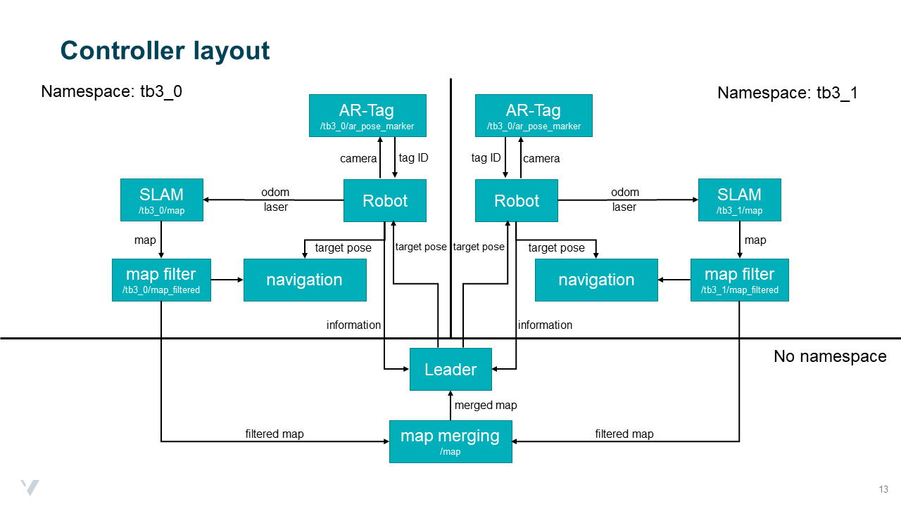

.. _ros_multi_robot:

************************************
Working with multiple robots in ROS
************************************

Semester project
=====================================================
The ROS package which you use for your semester project can be downloaded `here <https://hvl365.sharepoint.com/:f:/s/RobotikkUndervisningHVL/EvZ3c7F1UaJBibTwLuER8u0BB8-LgIv21KM9Ah1lYZCt5A?e=gdpx23>`_. The suggested controller layout looks like this: 

The different worlds including the main ROS packages are started as follows:

.. code::

   roslaunch multi_robot_challenge rescue_robots_w0.launch
   
This command launches world 0. You can launch different worlds by changing 0 to another number between 0 and 5. The python controller scripts (robot.py, map_filter.py and leader.py) are started with the following launch file:

.. code::

   roslaunch multi_robot_challenge controller.launch

Namespaces
=====================================================

Parallel SLAM with two robots
==========================================

Merging maps
=========================
The ROS package multirobot_map_merge takes as input multiple maps and tries to merge them into one. More information on the package can be found `here <http://wiki.ros.org/multirobot_map_merge>`_. To use the package you first need to install it by using the following command in your terminal:

.. code::

   sudo apt install ros-melodic-multirobot-map-merge
   

