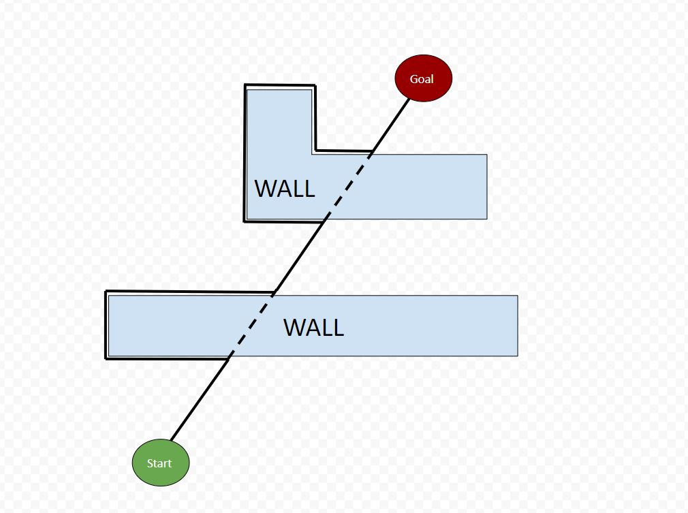
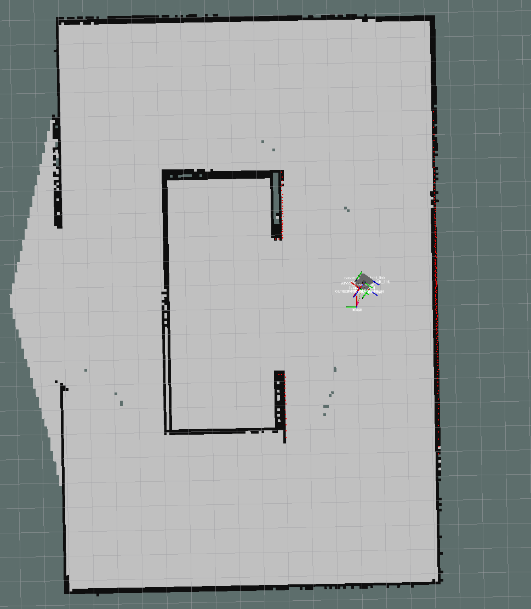
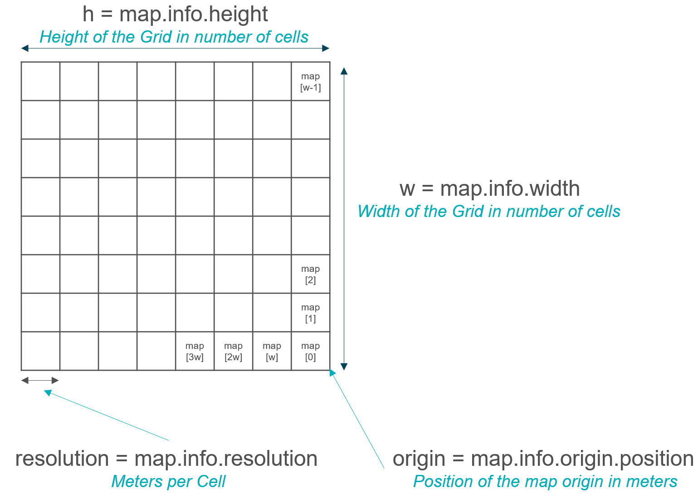

.. _ros_robot_navigation:

**********************************
Robot navigation with ROS
**********************************

Launching one robot in gazebo (preparation)
========================================================
The video called **Launch One Robot in Gazebo** should be available on Canvas in the Media Gallery. It explains the different components of the launch file which includes the gazebo world, Turtlebot3, SLAM package and RVIZ. Watch it as a preparation for the Lecture. To replicate what has been done in the video and prepare a ROS package for the lecture the needed files can be downloaded `here <https://hvl365.sharepoint.com/:f:/s/RobotikkUndervisningHVL/EiMkZWhQFVBGuSMwCKt169MBSl2zqY5AUcCk0dvRSBtxQQ?e=6a2zg8>`_.

Go to Point
============================
The robot is supposed to turn until it faces in the direction of the target. Once it does it should stop turning and move forward as long as the robot still faces towards the target point. Repeat until the goal is reached. The following code is a starting point and has to be adapted to achieve the wanted behavior:

.. literalinclude:: ../../_static/scripts/ros_navigation/go_to_point.py
       :language: python
       :caption: go_to_point.py

Follow wall
============================
The robot should have 3 behaviors: find wall, turn left and follow wall. When no wall is close enough, the robot is supposed to move forward and to the right until it finds one. Then the robot should turn left until it faces parallel to the wall. During wall following it should just move forward as long as the previous two statements are still true. The following code is a starting point and has to be adapted to achieve the wanted behavior:

.. literalinclude:: ../../_static/scripts/ros_navigation/follow_wall.py
       :language: python
       :caption: follow_wall.py

Bug2 Algorithm
============================
In the beginning the robot should calculate a direct line between its current position and the target position. It should the start following that line as long as it doesn't run into an obstacle. If it does, it should start following the obstacle until it reaches a point on the line which is closer to the target then the point where it encountered the obstacle. The robot should repeat these behaviors until the goal is reached. You are supposed to use the previous two scripts (got to point and follow wall) to achieve this behavior. Each script should run separately while communicating through ROS the necessary information. The following code is a starting point for the bug2 algorithm script and has to be adapted to achieve the wanted behavior:

.. literalinclude:: ../../_static/scripts/ros_navigation/bug2.py
       :language: python
       :caption: bug2.py

Reading the map
==========================================
The map data published by the SLAM algorithm has the type OccupancyGrid. It is a list of integer values where each value shows the probability of an obstacle being there with a value between 0 and 100, where 100 (displayed in rviz as black) means high probability and 0 (white) means no obstacle. The map values can also be -1 which stands for unknown areas.

          
The following python script is a short example of how to subscribe to a map topic:

.. literalinclude:: ../../_static/scripts/ros_navigation/occupancy_grid.py
       :language: python
       :caption: Short example of how to subscribe to a map topic

As already mentioned previously, the map is stored in a list of int values. The following image gives a visualization of what list item corresponds to what cell on a two dimensional grid as well as how to access certain properties in python which can be used to transform between grid cells and position values:

Move Base
========================================================
The **move_base** package lets you move a robot to desired positions using the navigation stack. It starts a ros node which runs an action server. To use the move_base package in your own ROS package, add the following lines to the under section "Launching One Robot in Gazebo" created launch file:

.. literalinclude:: ../../_static/scripts/ros_navigation/move_base.launch
       :language: C
       :caption: adding move_base package to the previously created launch file

The following code gives an example of how to send a desired position to the move_base action server from a python script:

.. literalinclude:: ../../_static/scripts/ros_navigation/move_base.py
       :language: python
       :caption: Sending a target to the move_base action server

Orientation (Quaternions)
--------------------------
Quaternions is a number system which can be used to describe 3 dimensional roations. When sending a target to the move_base action server, it expects a pose which conists of the position (x, y, z) and the orientation (in quaternions). It is out of the scope of this course to explain what they are and how they work but if you are curious you can look at `this video <https://www.youtube.com/watch?v=d4EgbgTm0Bg>`_. You can use the following function to calculate the orientation for the robot given just one angle (in `radian <https://en.wikipedia.org/wiki/Radian>`_):

.. literalinclude:: ../../_static/scripts/ros_navigation/quaternions.py
       :language: python
       :caption: Function that takes the wanted angle as an argument and returns the quaternion orientation representation
