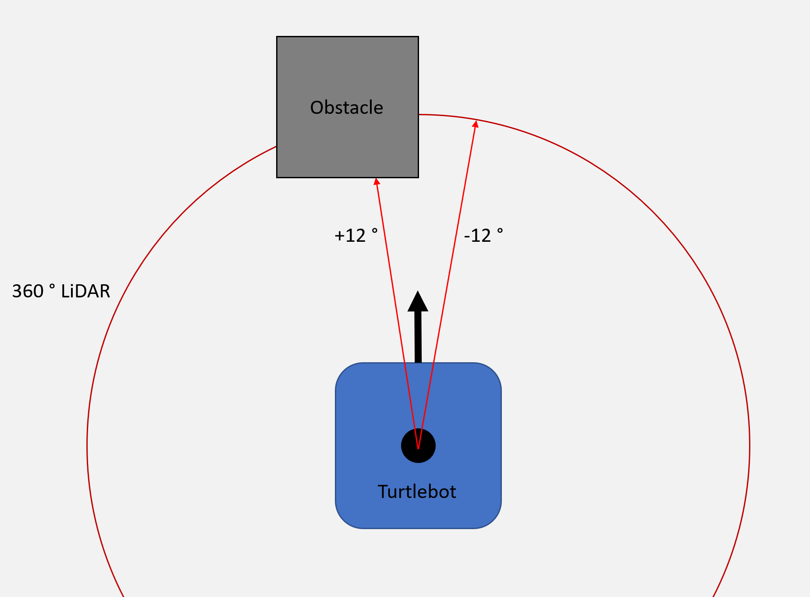
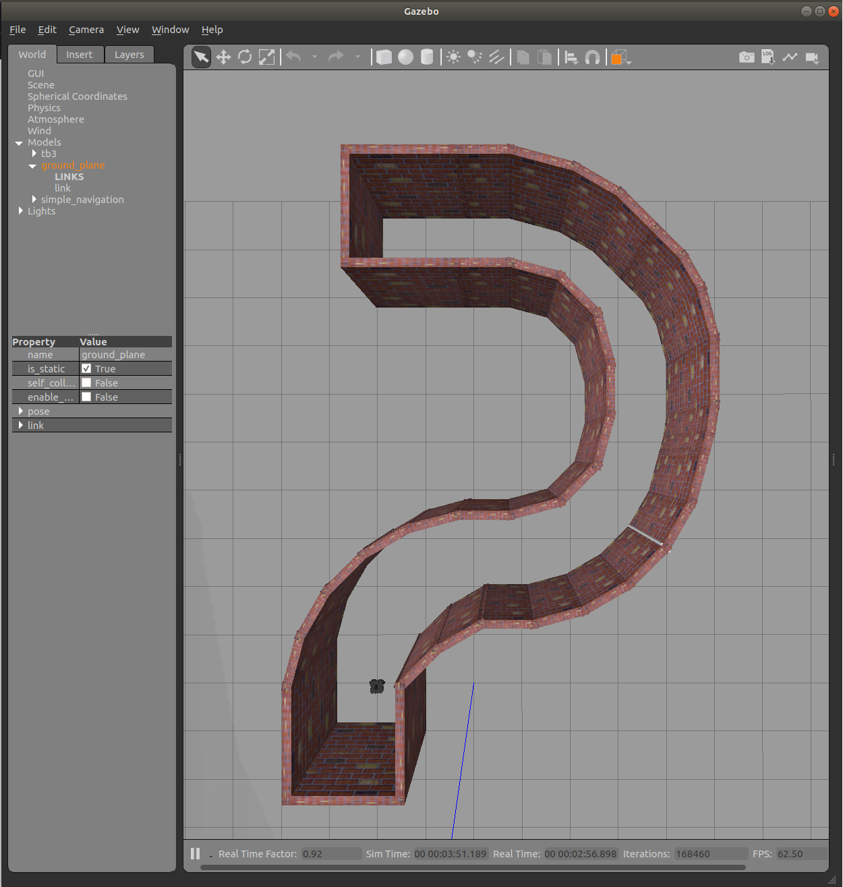

.. _ros_simple_navigation_exercise:

***************************************************
[Exercise] Simple Navigation on a Turtlebot Robot
***************************************************

In this exercise you will create a controller which navigates a turtlebot robot through an obstacle course. The steps to complete this task will be outlined but the exact code/commands needed you will have to figure out yourself using what you have learned in the lecture, the information available on this website or what you can find on the internet.

You will control a Turtlebot in a simulated environment. Using two points (+12 and -12 degrees) from the 360 degree onboard LiDAR as input, the robot should show the following behaviours:

* No obstacles are detected -> move forward
* Only the left sensor detects an obstacle -> turn right
* Only the right sensor detects an obstacle -> turn left
* Both sensors detect an obstacle -> stop

Setup Process
==============================================

* Create a ros package with the name **simple_navigation_exercise** and the following dependencies: **std_msgs**, **rospy**, **gazebo_ros**:

::

  cd ~/catkin_ws/src  # change directory into source folder in our catkin workspace
  catkin_create_pkg simple_navigation_exercise std_msgs rospy gazebo_ros  # create new package
  cd ..  # change directory to where /src folder located
  catkin_make  # build packages
  source devel/setup.bash  # Tell Linux that we have new built packages there
  rospack profile  # Tell ROS that we have new packages and update the list

* Inside the package create new folders with the names **launch** and **worlds**.

::

  roscd simple_navigation_exercise
  mkdir launch worlds

* Download already prepared files `here <https://hvl365.sharepoint.com/:f:/s/RobotikkUndervisningHVL/EqWEpWUR_qpKv9oWZ_hCQicBwff0IHeYyzTlxF6nDPc32Q?e=xJCZmT>`_.
* Copy the **.launch** file into the launch folder, the **.py** file in the src folder and the **.world** file in the worlds folder.
* Make the python script executable

::

  roscd simple_navigation_exercise/src
  chmod +x controller.py

* Test if the setup process was done correctly by running the launch file. Gazebo should open up with the obstacle course and a turtlebot.

::

  roslaunch simple_navigation_exercise spawn_robot.launch

* To run the controller use the following command in a new terminal after the launch file is running:

::

  rosrun simple_navigation_exercise controller.py

Exercise
==============================================
#. Open up the **controller.py** file with the editor of you choice (e.g. Atom). Inside the python script you will comments showing you where to write the different code snippets (marked with **TODO**).
#. Initialize a ros node
#. Create a subscriber to the **/scan** topic using as a callback function the already existing function inside the class called **clbk_laser**
#. Create a publisher to the **/cmd_vel** topic
#. Inside the **runNavigation** function set *vel_msg.linear.x* and *vel_msg.angular.z* depending on the values from *self.lidar_left_front* and *self.lidar_right_front*
#. When the robot reaches the finish set *finished* to True
