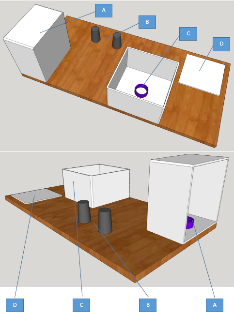

Lab 1
****************************

# Lab 1

## Theme

1. Waypoints.
1. Motion – MoveJ og MoveL.
1. End-effector – use of gripper.
1. Pick and place.

## Equipment

1. UR5 / UR5e robot with PolyScope (they are different, old/new).
1. Robotiq 2-Finger Adaptive Robot Gripper / Hand-E Gripper
1. Lab station with two boxes, two cups and a gripable object.

## Before the lab

1. Complete the [Universal Robots Academy](./UR_exercises.md) ***<-- this is very important!***
1. If first time then contact lab-assistant/phd-fellow/teacher. Expect thorough follow up.
1. Travel to the [HVL Robotics Lab](https://www.google.com/maps/place/HVL+Robotics+Lab/@61.4590375,5.8326453,17z/data=!3m1!4b1!4m5!3m4!1s0x4616333d5f3d88b5:0x2025abbba16257dd!8m2!3d61.459035!4d5.8348393)
1. Read and sign the lab rules.
1. Have all the fun with robots! If stuck then ask for help.

## Report

There is no need to hand in a report after this lab.

Signed attendance will suffice as approved lab exercise.

## Tasks

1. Repeat Universal Robots Academy Task 4. Creating a program, but this time on a real robot.
    1. Make a triangle using MoveJ, then using MoveL, and finally using MoveP.
    1. Pick up a real box, place it somewhere else.

1. Repeat Universal Robots Academy Task 10. You may find it in the *PRO Track* section of the Universal Robots Academy - not in the *Core* section. The task is named feature coordinates. This time you will compute the task on a real robot and you decide the real/imaginary box.

## Race pace

Finally! A challenge. A series of demands are listed below, make a program to fufill them. Make your program both as fast and smooth as possible. This is a contest!

1. Build the course in the picture below.
1. Place the object in box C.
1. Make the start position for the robot straight up, pointing to the sky.
1. Pick up the object
1. Move between the two cups B, not over!
1. Place object in box A

## Questions

1. What is this thing UR calls "Feature"?
    1. Which ones did you use?
    1. Where were their respectice origo?
    1. What is their use?

1. What is MoveJ, MoveL and MoveP? Describe the difference, and when to use what.
1. What was your fastest race time?

