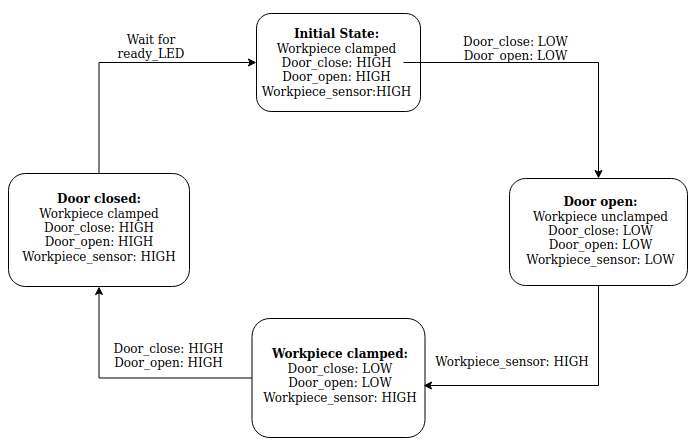

.. _Advanced-UR:

****************************
Advanced UR
****************************

.. warning::
    Before connecting IO, turn the robot off and disconnect the power.
    Wait a minute for any charge to dissipate. Or risk the unfortunate
    fate of being human toast.

.. warning::
    If we wear out the IO connections by abusing them, I will be a very sad panda.

.. note::
    You can store your installation as you store a program. Changes to
    the default installation will be deleted.

Theme
==============================================

#. External E-stop
#. Digital IO for program flow
#. Relative waypoints
#. Built-in functions
#. Templates
#. Machine tending

Equipment
==============================================
#. UR5 / UR5e robot with PolyScope (they are different, old/new).
#. Robotiq 2-Finger Adaptive Robot Gripper / Hand-E Gripper
#. Lab station with

    #. E-stop, box with red button and 2 sets of wiring
    #. Workpiece holder
    #. Stack of workpieces
    #. Big box with sliding door.

Before the lab
==============================================
#. Complete the `Universal Robots Academy <./UR_exercises.html>`_ ***<-- this is very important!***

    * "3. Setting up a tool"
    * "7. Safety settings"
    * "9. Program Flow"
    * "10. Feature Coordinates"

#. Try to get together in a group of 2-4 people, plz.

#. Top tip for preparing: Use the `offline simulator from UR <https://www.universal-robots.com/download/?option=41508&fbclid=IwAR1yU32_hPdsL40SljlNJBEC9J9uIRgfqNrnM8_6hQLOALupTzte9jB3-ss#section41493>`_.
   For the ambitious; do all your programming in the simulator,
   bring your saved program to the lab, bridge the simulation gap, success!

Report
==============================================
There is no need to hand in a report after this lab.

Signed attendance will suffice as approved lab exercise.

Tasks
==============================================
#. `Connect and test E-stop`_
#. `Connect Control box digital IO's, test IO's`_
#. `Elements of the Work Station`_
#. `Finite-State Sequence of the Machine Tending Box`_
#. `Make a program to open the machine door`_
#. `Make a program to close the machine door`_
#. `Make a program to pick up a workpiece`_
#. `Make a program to place a workpiece in the work station`_
#. `Make a program to place workpieces in a grid`_
#. `Combine everything to a complete machine tending program`_

_`Connect and test E-stop`
==============================================
The UR cabinet is ready for the E-stop to be connected using a screwdriver.
The E-stop IO's in the cabinet are all connected by short-wires, giving
the E-stop inputs high signals at all times. If, for any reason,
this voltage goes away, an emergency stop is triggered just as
when using the E-stop on the pendant.

The new E-stop contains 2 NC switches. If the red button is pressed, the
switches are opened, breaking the circuits.

#. Shutdown the robot
#. Disconnect power
#. Wait a minute
#. Connect the new E-stop
#. Fire up the robot again and verify that all E-stops work

_`Connect Control box digital IO's, test IO's`
========================================================
You will connect a total of 4 digital inputs to the UR, from the control box.

#. Shutdown the robot
#. Disconnect power
#. Wait a minute
#. Make the necessary connections to connect buttons and indicators
   to digital I/O.
#. Fire up the robot again
#. Test and name the inputs

_`Elements of the Work Station`
====================================

          
#. Door_open sensor
#. Door_close sensor
#. Workpiece_sensor
#. Clamp servo
#. Ready_LED and busy_LED

_`Finite-State Sequence of the Machine Tending Box`
===========================================================
Set the machine to its initial state when starting up.

_`Make a program to open the machine door`
========================================================
Make a program to open the machine door. This might sound easier than it is.
Feel free to fasten the box. Consider using force control.

_`Make a program to close the machine door`
========================================================
Make a program to close the machine door. Same as above, but close.

_`Make a program to pick up a workpiece`
========================================================
Make a program to pick a workpiece. There are several ways to this.
Consider the following suggestion as a starting point:

#. Move to a waypoint above the workpiece.
#. Close gripper.
#. Lower slowly relative to the waypoint above, until workpiece is detected.
#. Relative move up 1 cm.
#. Open gripper.
#. Move to position.
#. Pick workpiece.

The direction option can be used to detect an object on contact and perform an action.
Also, have a look at stack/de-stack options on the UR5e.

It is also possible to detect the force applied to the gripper on contact,
with pre-built functions. Have a look at them!

Tip: `my_variable = get_actual_tcp_pose()` and add 0.01 meters to the
Z index `[2]`, then MoveL to this variable position.

_`Make a program to place a workpiece in the work station`
==============================================================
Make a program to place a workpiece in the work station. Try to be as accurate as
possible when placing the workpiece!

_`Make a program to place workpieces in a grid`
========================================================
Make a program to place the workpieces in a grid. There are several ways to this.
Consider the following suggestion as a starting point:

#. Make a waypoint at a corner of your grid.
#. Make a counter, row_num.
#. Increment counter each time a box is picked from machine.
#. Offset placement waypoints by using row_num.
#. Add col_num to the mix.

Also, take a look at palletize/de-palletize options on the UR5e for the built-in template.

_`Combine everything to a complete machine tending program`
===============================================================
Using the above programs as subprograms or copy/paste source,
make a program to open the door, fetch the workpiece, place them in a grid,
feed the machine a new workpiece and close the door. Wait until its finished.
And repeat. One workpiece at a time.

Voilà! Kick your feet up and let the robot do all the work!

Questions
==============================================

#. The E-stop has 2 NC switches. Why?
#. How many tasks did you complete? What kept you from completing everything?
#. If the robot or the "CNC" changed location, how would you update the program?
#. What are the pros and cons between cobots and industrial robots?
#. Discuss how cobots can be applied to enhance workflow for a company, or in everyday life.
#. Does the configuration of the robot affect the applied force when opening/closing the door? 
#. Did you remember to have fun?
