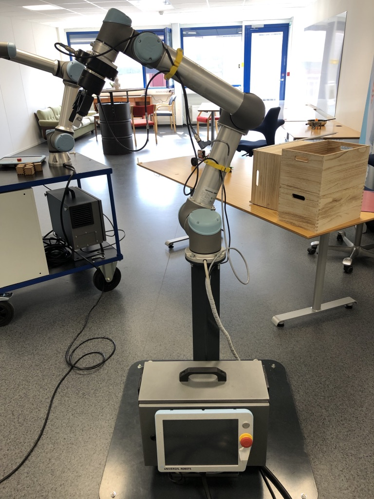

==============================================
Kalman Filter
==============================================

Content
==============================================

You will learn how to design a Kalman Filter to calculate the orientation and how good/bad compared to different techniques.
Those techniques are:

#. Accelerometer only
#. Gyroscope only
#. Complementary filter
#. Kalman filter

What is a Kalman filter?
==============================================

Here Kalman is explained theoretically. TODO: FILL IT LATER.

Experimental Process
==============================================

.. literalinclude:: ../_static/scripts/KalmanManual.m
   :language: matlab
   :linenos:
   :caption: Example 1. our code.
