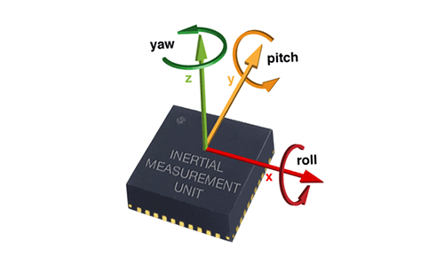
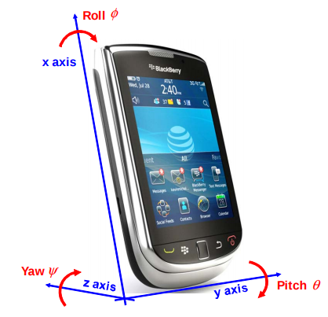
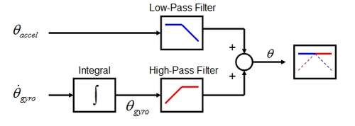
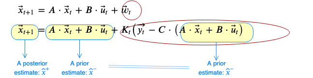

****************************
Orientation Estimation
****************************

Introduction
==============================================

You have learned that robot navigation is the problem of guiding a robot towards a goal in Chapter 5. In order to achieve navigation tasks, you need to localize your robot using some sensor systems (mentioned in Chapter 6). If you are doing outdoor applications with your robot, then you may use GPS signals from the satalites. However, it is not reliably applicable for intoor applications.

In order to get the information about the position/orientation of your robot, you may use some camera systems. After some image processing, you can determine your robot's position/orientation. What about your robot is a mobile robot, let say? What if your taks requires going from one room to another? Would you equip all the rooms with expensive cameras on each corners of each room? That would not be the most practical and wisely designed solution.

For instance, how do we get the orientation information from our mobile phones? They are *mobile* at the end, right? Mainly for this purpose, there is a sensor type called IMU (i.e. Inertial Measurement Unit) which can measures the angular velocity and the linear acceleration of the body - in this case your mobile phone.

There are different techniques to obtain position/orientation of the phone using angular velocity and the linear acceleration. In this tutorial, you will learn how to implement **four** different orientation calculation techniques using MATLAB and `IMU <https://www.spartonnavex.com/imu/>`_. Those techniques are:

#. `Integration of angular velocity`_ *(only gyroscope)*
#. `Inclination sensing`_ *(only accelerometer)*
#. `Complementary filter`_ *(accelerometer + gyroscope)*
#. `Kalman filter`_ *(accelerometer + gyroscope)*

.. note::
  You will find the explanations of all those techniques in the following sections. The values which has *hat* on top means that they are estimated values.

.. _`Integration of angular velocity`:

Integration of Angular Velocity
=======================================
Integration of angular velocity principle leans on the the basic idea: *the integral of the velocity is the position*. Since an IMU reads the angular velocity of the body, then *the integration of the angular velocity is the orientation*. In literature the orientation angles with respect to their rotation axes are defined as follows:

By this definition, the orientation angles are calculated as:

.. math::

    roll \rightarrow \phi &= \int_{t_0}^{t} G_x \Delta t\\
    pitch \rightarrow \theta &= \int_{t_0}^{t} G_y \Delta t\\
    yaw \rightarrow \psi &= \int_{t_0}^{t} G_z \Delta t\\

where :math:`G_x`, :math:`G_y` and :math:`G_z` are the angular velocities read by the IMU about x,y and z axes respectively in body fixed frame. To find the orientations with respect to world frame, you need this rotation matrix:

.. _`rotation matrix`:

.. math::

    \begin{bmatrix}
      \dot\phi \\
      \dot\theta \\
      \dot\psi
    \end{bmatrix}
    =
    \begin{bmatrix}
      1       &sin(\phi) tan(\theta)    &cos(\phi) tan(\theta) \\
      0       &cos(\phi)                &-sin(\phi)\\
      0       &sin(\phi) sec(\theta)    &cos(\phi) sec(\theta)
    \end{bmatrix}
    \cdot
    \begin{bmatrix}
      G_x \\
      G_y \\
      G_z
    \end{bmatrix}

and,

.. math::
  \hat\phi = \phi_{prev} + \dot\phi \Delta t\\
  \hat\theta = \theta_{prev} + \dot\theta \Delta t

.. warning::
  In theory, this method of orientation calculation works perfect. However the computers on which we are working are doing discrete calculations. On the other hand, we measure the angular velocity in real world, moving the phone in our hands. When you integrate a continuous signal in a discrete environment, you have an accumulation problem (i.e. drift error).

  .. figure:: ../_static/images/accumulationError.png
            :align: center

  Although `Integration of angular velocity`_ looks a clean-cut for short period of time, it is not the best solution for longer periods.

.. _`Inclination  sensing`:

Inclination Sensing
=======================

Accelerometers are sensitive to both linear acceleration and the local gravitational field. If the linear acceleration on the body is negligble, then assume that the only acceleration exerting on the body is the gravity. In our case, as the body stays still, the gravitational acceleration is measured only by the z-axis of the IMU.

.. figure:: ../_static/images/tilt0.png
          :align: center

If we rotate the IMU, let say :math:`\theta` angles around y-axis, then the gravity vector is expressed by x and z components on the IMU readings.

.. figure:: ../_static/images/tilt1.png
          :align: center

.. note::
  There is still no component of gravity vector along the y-axis of the IMU since the rotation was made around y-axis.

In more general form,  the rotation is not only around one axis. If the IMU is rotated around x and y axes, by calling the rotation :math:`\phi` around x-axis, the vectoral representation would be like that:

.. figure:: ../_static/images/tilt2.png
          :align: center

Here the :math:`\theta` and :math:`\phi` angles is found by the following formula:

.. math::

    tan(\phi) = - a_y / \tilde a_z = - a_y / \sqrt (a_x^2 + a_z^2)\\
    tan(\theta) = a_x / \tilde a_z = a_x / \sqrt (a_y^2 + a_z^2)
    

Therefore,

.. math::

    \hat\phi = arctan(\frac{-A_y}{\sqrt{A_x^2 + A_z^2}})\\
    \hat\theta = arctan(\frac{A_x}{\sqrt{A_y^2 + A_z^2}})
    

.. seealso::
  In order to find the rotation angles, we may either use rotation matrices or we can approach geometrically. You have already seen how to calculate rotation matrices in your earlier lessons. You can try calculating :math:`\theta` and :math:`\phi` using rotation matrices by yourself and finding out the same results as here. You can check the reference :cite:`tuck2007tilt`.

.. warning::
  As you see, we calculated only pitch and roll angles but not yaw. The reason for that, any motion about z-axis doesn't give any variation in accelerometer readings. It is not possible detect the rotations around z-axis using *only accelerometer*.

.. _`Complementary filter`:

Complementary Filter
=======================
Idea behind complementary filter is to take slow moving signals from accelerometer and fast moving signals from a gyroscope and combine them. Accelerometer gives a good indicator of orientation in static conditions. Gyroscope gives a good indicator of tilt in dynamic conditions. So the idea is to pass the accelerometer signals through a low-pass filter and the gyroscope signals through a high-pass filter and combine them to give the final rate.

To implement `Complementary filter`_, first a constant :math:`\alpha` angle is chosen as a cut-off value for the filters. The larger :math:`\alpha`, the more the accelerometer measurements are ‘trusted’. As :math:`\alpha` goes to zero, we base our estimate mainly on the gyroscope measurements. A good starting point is :math:`\alpha` = 0.1.

.. math::

  \hat{\phi} = \alpha \cdot \hat\phi_{Acc} + (1-\alpha) \cdot (\hat\phi_{prev}+ \dot\phi_{Gyro} \cdot \Delta t)\\
  \hat{\theta} = \alpha \cdot \hat\theta_{Acc} + (1-\alpha) \cdot (\hat\theta_{prev}+ \dot\theta_{Gyro} \cdot \Delta t)\\

.. _`Kalman filter`:

Kalman Filter
=======================
Kalman filter is one of the most common estimation algorithms. It produces estimates of imponderable states of a system based on the past estimations and current measurements. In another words, it is an estimator (and observer). Using the system model, it reduces the estimation error in every iteration. In our case, we can measure angular velocity and linear acceleration but we cannot measure orientation. In this case orientation is an imponderable state. Though, it is possible to calculate the orientation using the systems mathematical model.

.. note::

  As you know, every linear time-invariant (LTI) system can be modelled as:

  .. math::

    \begin{split}
      \vec{\hat{x}}_{t+1} &= \textbf{A} \cdot \vec{\hat x}_t + \textbf{B} \cdot \vec{u}_t + \vec{w}_t \label{eqn:state1}\\
      \vec{\hat{y}}_{t} &= \textbf{C} \cdot \vec{\hat x}_{t} + \vec{v}_{t} \label{eqn:state2}\\
      \vec{\tilde{y}}_{t} &= \vec{y}_{t} - \vec{\hat{y}}_{t} \label{eqn:state3}
    \end{split}

  Where :math:`\vec{\hat x}_{t}` is the estimated \textbf{system state vector}, :math:`\vec{u}_t` is the \textbf{input vector}  and :math:`\vec{y}_t` is the \textbf{measurement vector} at time t.
    
      :math:`\textbf{A}` : system matrix (relates the current states to the next states)
    
      :math:`\textbf{B}` : input matrix (relates inputs to the next states)
    
      :math:`\textbf{C}` : output matrix (system states to the measured states)
    
      :math:`\vec{w}_t` : process noise
    
      :math:`\vec{v}_t` : measurement noise 
      
      :math:`\vec{\hat{x}}_{t+1}` : estimated state vector for the next time step.
      
      :math:`\vec{\hat{y}}_{t}` : estimated measurement vector (observation vector)
      
      :math:`\vec{\tilde{y}}_{t}` : error between the actual measurement and the estimated

.. _`system state`:

We choose our system states as:

.. math::

  \vec{\hat x}_t = \begin{bmatrix} \hat{\phi}_t \\ \hat{\dot{\phi}}_{b_t} \\ \hat{\theta}_t \\ \hat{\dot{\theta}}_{b_t} \end{bmatrix}

Where :math:`\hat{\dot{\phi}}_{b_t}` is the gyro bias at time t associated with our estimate :math:`\hat{\phi}` and :math:`\hat{\dot{\theta}}_{b_t}` is the gyro bias at time t associated with our estimate :math:`\hat{\theta}`.

.. _`input vector`:

Our inputs:

.. math::

  \vec{u}_t = \begin{bmatrix} \dot{\phi}_{G_t} \\ \dot{\theta}_{G_t} \end{bmatrix}\\

Where :math:`\dot{\phi}_{t}` and :math:`\dot{\theta}_{t}` are the gyroscope values for roll and pitch respectively.

.. _`measurement vector`:

Our measurements:

.. math::

  \vec{y}_t = \begin{bmatrix} \hat{\phi}_{Acc_t} \\ \hat{\theta}_{Acc_t} \end{bmatrix}

Implementation of Kalman filter
--------------------------------
Kalman Filter is based on modelling the process noise. As well, the Kalman filter provides a prediction of the future system state by prediction. Therefore Kalman filter consists of two parts;
**Prediction** and **Correction**.

.. figure:: ../_static/images/KalmanEqns2.png
  :align: center

After defining all the parameters, now we can start building up the Kalman filter. In prediction step, the system model is used in calculation of error covariance matrix **P**.

**Prediction**

.. math::

  \vec{\hat x}_{t+1} = \textbf{A} \cdot \vec{\hat x}_t + \textbf{B} \cdot \vec{u}_t\\
  \textbf{P} = \textbf{A} \cdot \textbf{P} \cdot \textbf{A}^T + \textbf{Q}

Then, this error covariance matrix is used in updating the Kalman gain **K**. (In some resources, you can see this step is named as **Update** for this reason.)

**Correction**

.. math::

  \widetilde{y}_{t} = \vec{y}_{t} - \textbf{C} \cdot \vec{\hat x}_{t+1}\\
  \textbf{S} = \textbf{C} \cdot \textbf{P} \cdot \textbf{C}^T + \textbf{R}\\
  \textbf{K} = \textbf{P} \cdot \textbf{C}^T \cdot \textbf{S}^{-1}\\
  \vec{\hat x}_{t+1} = \vec{\hat x}_{t+1} + \textbf{K} \cdot \widetilde{y}_{t}\\
  \textbf{P} = (\textbf{I} - \textbf{K} \cdot \textbf{C}) \cdot \textbf{P}

Where,

**K** is the Kalman gain,

**P** is the error covariance,

**Q** is covariance matrix of the process noise,

**R** is covariance matrix of the measurement noise,

.. note::

  Lower variance in measurement noise (R -> 0) makes the Kalman gain **K** closer to 1 and our estimates will be more based on the measurements.

  .. math::

    \lim_{\textbf{R} \to 0} \textbf{K} = \frac{\textbf{P}^- \cdot \textbf{C}^T}{\textbf{C} \cdot \textbf{P}^- \cdot \textbf{C}^T + (\textbf{R}=0)} \rightarrow \textbf{K} = \textbf{C}^{-1}

  Substitute into the estimation equation:

  .. math::

    \hat{x} ^+ &= \hat{x} ^{-} + \textbf{K} \cdot (y ^{-} - \textbf{C} \cdot \hat{x} ^- )\\
             &= \hat{x} ^{-} + \textbf{C}^{-1} \cdot (y ^{-} - \textbf{C} \cdot \hat{x} ^- )\\
             &= \hat{x} ^{-} + \textbf{C}^{-1} \cdot y ^{-} - \textbf{C}^{-1} \cdot \textbf{C} \cdot \hat{x} ^{-}\\
             &= \textbf{C}^{-1} \cdot y ^{-}

  :math:`C^{-1}` is equal to 1 in our case. Therefore the estimated value is only depend on the measured value, not prior estimates.

  .. math::

    \hat{x} ^+ &= y ^{-}\\

.. note::

  If in the first case the prior estimate covariance is zero (P -> 0), then only prior estimates contribute to our current estimation.

  .. math::

    \lim_{\textbf{P} ^{-} \to 0} \textbf{K} = \frac{(\textbf{P}^- = 0) \cdot \textbf{C}^T}{\textbf{C} \cdot (\textbf{P}^- = 0) \cdot \textbf{C}^T + \textbf{R}} \rightarrow \textbf{K} = \frac{0}{\textbf{R}} = 0

  Substitute into the estimation equation:

  .. math::

    \hat{x} ^+ &= \hat{x} ^{-} + \textbf{K} \cdot (y ^{-} - \textbf{C} \cdot \hat{x} ^- )\\
               &= \hat{x} ^{-} + \textbf{0} \cdot (y ^{-} - \textbf{C} \cdot \hat{x} ^- )

  Therefore the estimated value is only depend on the prior estimates, not measurements.

    .. math::

      \hat{x} ^+ &= \hat{x} ^{-}\\

.. warning::
 The Kalman filter is only applicable in casual, linear and time-invariant systems. If the system model is not satisfy these three conditions, then another type of filter/estimator/observer or a different variation of Kalman filter should be implemented.

Experimental Process
==============================================
To implement those four orientation estimation techniques, we will use MATLAB and a smartphone.

**On your smartphone**

#. In Google Store, install **Sensor Fusion App** (IOS phones can follow the Follow the `link <https://1drv.ms/u/s!Au2fyLreLQhQhpI-iEv3ZTGYpJzjEA?e=aGdPOU/>`_ and use the *sensorLog_2pitch.txt* instead. They don't need to follow these steps.)
#. Select the first item *Select Sensor* and check if your accelerometer works fine. During a steady mode of your phone while its screen facing upwards, only the z-axis of the accelerometer should give 9.8 :math:`m/s^2` and other axes should be 0.
#. Check if your gyroscope works fine. During a steady mode of your phone all axes should be 0. If there is a little fraction, it is the bias on your gyroscope data.
#. In the main screen, select the second item *Log Data*.
#. Check *Accelerometer* and *Gyroscope* and uncheck other sensors. We will not need them for this tutorial.
#. Check the *Log* option on the upper right corner so that the app can create a log file.
#. As soon as you hit the *Start* button, the log file is started to be written on. It is always better to start measurement from a steady state. Too long data will incrase the processing time in your code.
#. When you are done, hit *Stop* button.
#. Send the **sensorLog_date&hour.txt** file to your computer.

**On your computer**

#. Follow the `link <https://1drv.ms/u/s!Au2fyLreLQhQhpI-iEv3ZTGYpJzjEA?e=aGdPOU/>`_. There are 3 files. read_log_script.m is a script which reads your log data and extracts the accelerometer and gyroscope values into corresponding variables. Edit your log data file name in the :math:`10^{th}` line.

    .. literalinclude:: ../_static/scripts/read_log_script.m
       :language: matlab
       :lines: 10

#. In our main file, we first call our script.

    .. literalinclude:: ../_static/scripts/KalmanManual.m
       :language: matlab
       :lines: 7

#. You are going to use `rotation matrix`_ equations in the first section:

    .. literalinclude:: ../_static/scripts/KalmanManual.m
       :language: matlab
       :lines: 32-42

#. You are going to use the geometrical approach in `Inclination sensing`_ section:

     .. literalinclude:: ../_static/scripts/KalmanManual.m
        :language: matlab
        :lines: 46-47

#. You are going to use your estimated :math:`\phi` and :math:`\theta` values in which you have calculated in the previous steps. :

     .. literalinclude:: ../_static/scripts/KalmanManual.m
        :language: matlab
        :lines: 56-69

#. You are going to fill the missing equations in `Kalman filter`_.

     .. literalinclude:: ../_static/scripts/KalmanManual.m
        :language: matlab
        :lines: 85-115

Conclusion and Further Readings
==============================================

We have seen some filtering algorithms applied on IMU in order to get some orientation data. The most important lesson in this tutorial is to realize that the sensor systems are not completely reliable if you are reading the raw data. As it is mentioned at the beginning, other localization solutions such as using GPS data or camera systems are also requires after-processing as we did on IMU in the tutorial. Today, some of the expensive sensor systems have their own filtering circuits inside the sensor.

`Further reading here <http://philsal.co.uk/projects/imu-attitude-estimation>`__
hello

.. bibliography:: ../references.bib
