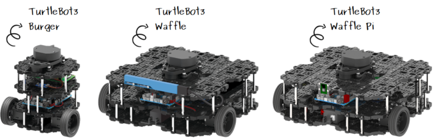
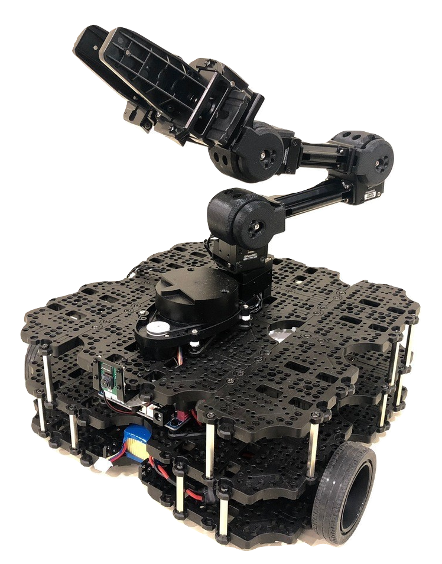
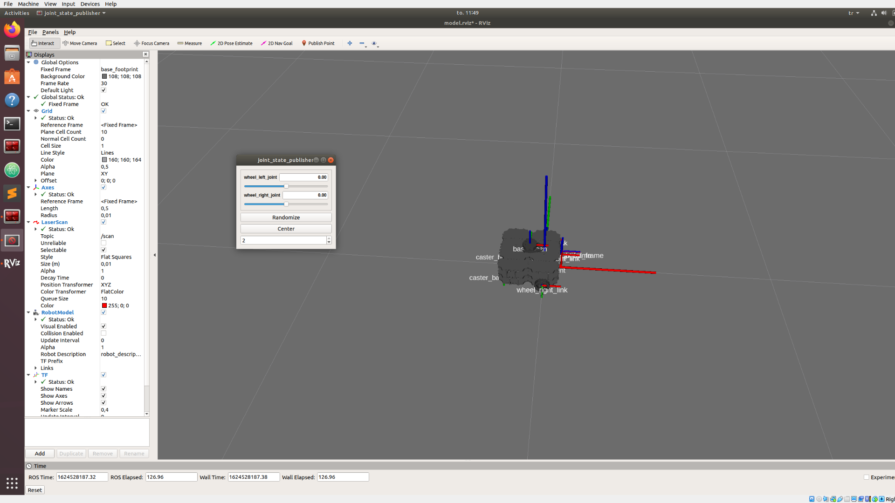
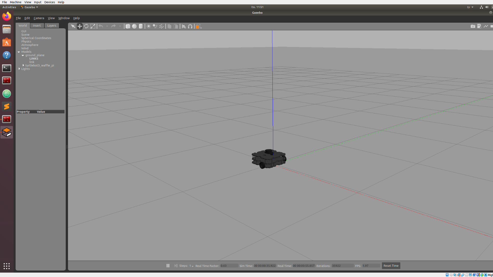
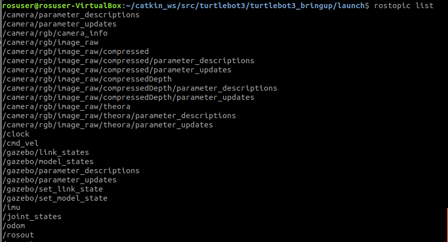
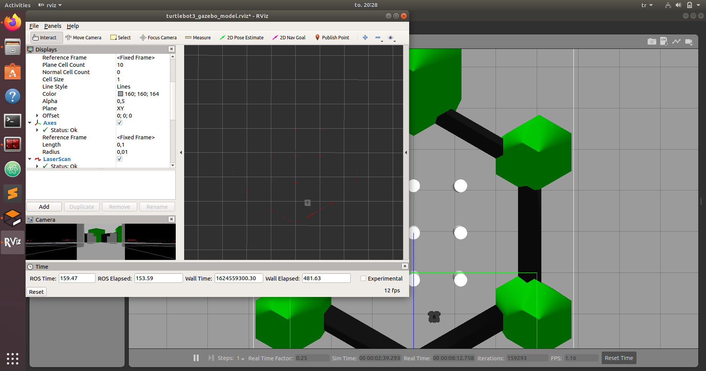

.. _Getting-Started-with-Turtlebots:

***************************************
Getting Started with Turtlebots
***************************************

Before diving into the core of ROS, let's see and practice on capabilities of ROS. We are going to simulate a *Turtlebot Waffle Pi* with and without the *Open Manipulator* on. Turtlebot Waffle Pi is a generic differential robot with 2 actuated wheels and one passive ball joint. It is the same model which you are supposed to use in your project.

In this lecture, we are going see how to visualize, control, simulate such a robot in the ROS environment as well as exploring the available data using the ready-to-use turtlebot packages.

          Source: `emanual.robotis.com <https://emanual.robotis.com/docs/en/platform/turtlebot3/features/>`_

          Source: `www.robotlab.com <https://www.robotlab.com/store/robotis-turtlebot-openmanipulator>`_

Theme (Lab4)
==============================================

#. Turtlebot tutorials
#. ROS
#. Turtlebot
#. Bringups
#. Get familiar

Equipment (Lab4)
==============================================
#. PC with ROS installed
#. Turtelbot tutorials from `robotis.com <https://emanual.robotis.com/docs/en/platform/turtlebot3/overview/>`_

Before the lab (Lab4)
==============================================
#. Install ROS.

#. Try to get together in a group of 2-4 people.

#. To use a real turtlebot, find your way to the HVL Robotics lab.

Report (Lab4)
==============================================
There is no need to hand in a report after this lab.

Signed attendance will suffice as approved lab exercise.

Tasks (Lab4)
==============================================
#. `Setup, PC Setup, Remote PC`_
#. `Simulation`_
#. `Turtlebot Control`_
#. `Questions`_

_`Setup, PC Setup, Remote PC`
==============================================

.. note::
   The Turtlebot packages are already installed in the VM copy provided to you. However, for those who used a different installation method (for example dual boot, or your own VM) below are the basic instructions for installing the necessary packages.

   **How to install on ROS Melodic**:
   ::

      sudo apt-get install ros-melodic-dynamixel-sdk
      sudo apt-get install ros-melodic-turtlebot3-msgs
      sudo apt-get install ros-melodic-turtlebot3
      
      cd ~/catkin_ws/src
      git clone https://github.com/ROBOTIS-GIT/turtlebot3_manipulation.git
      git clone https://github.com/ROBOTIS-GIT/turtlebot3_manipulation_simulations.git
      git clone https://github.com/ROBOTIS-GIT/open_manipulator_dependencies.git
      git clone https://github.com/ROBOTIS-GIT/dynamixel-workbench.git
      git clone https://github.com/ROBOTIS-GIT/dynamixel-workbench-msgs.git
      
      cd ..
      rosdep install --from-paths src --ignore-src -r -y
      catkin_make
      source devel/setup.bash

   Note that in general, the following packages are available for the Turtlebots, depending on your exact model and needs:

   * OM+TB3: https://github.com/ROBOTIS-GIT/open_manipulator_with_tb3
   * OM: https://github.com/ROBOTIS-GIT/open_manipulator and https://github.com/ROBOTIS-GIT/open_manipulator_simulations
   * TB: https://github.com/ROBOTIS-GIT/turtlebot3.git
   * TB manipulation: https://github.com/ROBOTIS-GIT/turtlebot3_manipulation_simulations and https://github.com/ROBOTIS-GIT/turtlebot3_manipulation

_`Simulation`
==============================================
This lab is done with simulation. Using a real robot is later.

See `simulation tutorial <https://emanual.robotis.com/docs/en/platform/turtlebot3/simulation/#ros-1-simulation/>`_.

Simulations in ROS are done by both `RViz <http://wiki.ros.org/rviz>`_ and `Gazebo <http://gazebosim.org/>`_. These are not interchangable. Rviz is a ROS package for visualization purposes. On the other hand, Gazebo is a simulation environment with physical properties with gravity, lights/shadows, collisions, mass etc. Gazebo simulations can be considered as *real* robot since it requires `Gazebo ROS control <http://gazebosim.org/tutorials/?tut=ros_control>`_.

Turtlebot with RViz
---------------------

          Turtlebot in Rviz

#. Run the command: ``roslaunch turtlebot3_bringup turtlebot3_model.launch``
#. Fiddle with the **joint state publisher** gui.

.. note::
   You can run Rviz standalone with ``rosrun rviz rviz`` and load the desired tools on the left bar.

Turtlebot with Gazebo
----------------------

          Turtlebot in Gazebo

#. Run the command: ``roslaunch turtlebot3_bringup turtlebot3_empty_world.launch``
#. Navigate in Gazebo tools.

.. note::
   You can run gazebo as a ROS node with ``rosrun gazebo_ros gazebo`` or as standalone software by simply typing ``gazebo`` in the terminal. Please see the difference between these two commands. One starts a node which can communicate by other ROS nodes. The other one starts a standalone Gazebo software which can be used seperately than ROS.

   You can check the difference by checking which ROS nodes are running by ``rosrun rqt_graph rqt_graph`` or just listing available ROS nodes by ``rosnode list``. There will be no Gazebo related ROS node with ``gazebo`` terminal command but a node named **/gazebo** with ``rosrun gazebo_ros gazebo`` ROS command.

_`Turtlebot Control`
==============================================
When you launch the Gazebo simulated robot, there are several nodes started and those nodes publish/subscribe topics. 

          Available topics

#. Run the command: ``roslaunch turtlebot3_bringup turtlebot3_empty_world.launch``
#. See which nodes and topics are available:

   #. ``rosnode list``
   #. ``rostopic list``
   #. ``rostopic info /joint_states``
   #. ``rostopic echo /joint_states``

Normally, you can control wheel joints by publishing ``/joint_states`` topic in Rviz. However, to control a *real* robot you need a controller. There are various ways in achieving it in Gazebo but for this tutorial we have an already set *teleoperation* package which enables sending velocity commands to the robot by PC keyboard.

#. Run the command: ``roslaunch turtlebot3_teleop turtlebot3_teleop_key.launch``
#. Use W-A-S-D to control the robot speed
#. Check the available nodes: ``rosrun rqt_graph rqt_graph``
#. Chech the message in ``/cmd_vel`` with the command ``rostopic echo /cmd_vel``
#. Get info about the topic ``rostopic info /cmd_vel``
#. See what features have the ``rosmsg info geometry_msgs/Twist``
#. Kill the teleoperation launcher with Ctrl+C.
#. Control the robot velocity by publishing ``/cmd_vel`` via terminal (Use Tab auto completion): 

   ::

      rostopic pub cmd_vel geometry_msgs/Twist "linear:
      x: 0.0
      y: 0.0
      z: 0.0
      angular:
      x: 0.0
      y: 0.0
      z: 2.0" 

Only TB:
--------

In Gazebo:

::

   roslaunch turtlebot3_gazebo turtlebot3_empty_world.launch
   roslaunch turtlebot3_teleop turtlebot3_teleop_key

Only OM with JointPositionController:
-------------------------------------

::

   roslaunch open_manipulator_with_tb3_gazebo empty_world.launch
   rostopic pub /om_with_tb/joint1_position/command std_msgs/Float64 "data: 0.5"

Only OM with Moveit:
--------------------

::

   roslaunch open_manipulator_gazebo open_manipulator_gazebo.launch
   roslaunch open_manipulator_controller open_manipulator_controller.launch use_platform:=false use_moveit:=true

TB+OM with Moveit:
------------------

.. admonition:: Exercise
   Can you control both Turtlebot and the Open Manipulator? Start here: 

   ::

      roslaunch open_manipulator_with_tb3_gazebo empty_world.launch
   

..
   TODO: Moveit together: 
   ``roslaunch open_manipulator_with_tb3_waffle_pi_moveit demo_gizem`` but controller is not loaded somehow.

   
_`Turtlebot Retrieve Sensor Data`
==============================================
Most of the time there are various sensors on the robot where we get information about the robot state (battery percentage, speed, acceleration, encoder readings etc.) or about the environment (magnetization, obstacle distance, etc). For all these, we equip robots with necessary sensors.

On the real TurtleBot Waffle Pi and on the Gazebo simulated version, there are inertial measurement unit, encoder, camera and LIDAR where we can collect some data. 

Let's visualize the surrounding of the turtlebot.

          Turtlebot Gazebo retrieve camera data

#. Start the Gazebo robot in a different environment this time: ``roslaunch turtlebot3_gazebo turtlebot3_world.launch``
#. Start the Rviz to visualize sensor data: ``roslaunch turtlebot3_gazebo turtlebot3_gazebo_rviz.launch``
   #. Observe the red laser dots.
   #. Activate camera (select the checkmark)
#. Start teleoperation and navigate: ``roslaunch turtlebot3_teleop turtlebot3_teleop_key``
#. Observe active nodes and topics.

_`Questions` (Lab4)
==============================================

#. What is the Turtlebot3 Waffle Pi?
#. What is Rviz?
#. What is Gazebo?
#. What is a key difference between RViz and Gazebo?
#. How can you see running nodes?
#. How can you see available topics?
#. How can you see the message type of a topic?
#. **Bonus**: How can you see that topics are published/subscribed by a ROS node?

