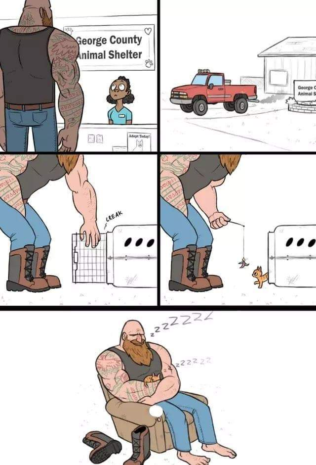

************************
L2- File System in ROS
************************

As briefly explained before, ROS is a meta-operating system running on a main Linux OS. Linux has a different file system management than Windows. Therefore, things might be confusing or not intuitive in the beginning. With lots of terminal commands and strage folder names like /root /home /var /proc /opt etc, Linux may look like even scary! However, there is a beautifully designed system underneath.

          *... dedicate in Linux*

No worries, it will pass. For very nerdy ones, `here <https://www.linux.com/training-tutorials/linux-filesystem-explained/>`_ is the short explanation of file system in Linux. It is not vital for this course, though.

What is important is the ROS file system, how to navigate between packages and the files in a package, where to download them and how to include them in the ROS path. If your packages are not installed in a correct location, they cannot be compiled and so they cannot be used.

.. note::
   Although you don't need to be an expert in the Linux file management, it is highly recommended to know some fundamentals in Linux commands. You can find `100 essential Linux commands <https://linuxhint.com/100_essential_linux_commands/>`_ and a short version `20 Main Linux commands that you will need daily <https://likegeeks.com/main-linux-commands-easy-guide/>`_.

Locating ROS packages
======================
There are two main locations of the ROS packages. One is your catkin_ws and one is in Linux /opt folder. You can check this with the following command:

   ::

      printenv ROS_PACKAGE_PATH
      >> /home/rosuser/catkin_ws/src:/opt/ros/melodic/share

   or

   ::

      echo $ROS_PACKAGE_PATH
      >> /home/rosuser/catkin_ws/src:/opt/ros/melodic/share

The packages in the **/home/rosuser/catkin_ws/src** are those you cloned from a github repository with ``git clone -b branch-name PACKAGE_URL``. Moreover, the packages in the **/opt/ros/melodic/share** are those you *installed* or *build* by ``apt`` command such as ``apt install ros-melodic-desktop-full`` or ``apt install ros-melodic-rviz`` etc.

To navigate between these files you can use the default Linux command: ``cd ~/catkin_ws/src/PACKAGE_NAME`` or ROS tailored cd: ``roscd PACKAGE_NAME``.

Uninstall a Package
--------------------

* Delete the respective folder in /catkin_ws/src/ 

or

* ``sudo apt purge PACKAGE_NAME``

/catkin_ws
==========

   |catkin is the official build system of ROS and the successor to the original ROS build system, 
   |rosbuild. catkin combines CMake macros and Python scripts to provide some functionality on 
   |top of CMake's normal workflow.

catkin_ws is a directory, located directly under the ``/home`` directory (in general), which has the source codes of your ROS packages. It is created as in `this tutorial <http://wiki.ros.org/catkin/Tutorials/create_a_workspace>`_ but you don't need to create one if you are using the VM copy provided in the beginning.

.. note::
   ``catkin_make`` is the general command to compile all the source code located in the /src folder.

catkin_ws contain 3 main folders:

* **/src** where the ROS packages located as source code.
* **/build** where the built ROS packages are located.
* **/devel** where the necessary shell comands for the Linux system to see this workspace.

   ::

      ├── catkin_ws                 -- WORKSPACE
         ├── build                  -- BUILD SPACE
         │   ├── CATKIN_IGNORE      -- Keeps catkin from walking this directory
         |   ├── ...
         ├── devel                  -- DEVELOPMENT SPACE
         │   ├── setup.bash         -- to be sourced
         │   ├── ...
         └── src                    -- SOURCE SPACE
            ├── package_1
            │   ├── CMakeLists.txt
            |   ├── package.xml
            │   ├── src
            │   ├── launch
            │   ├── ...
            ├── package_n
            │   ├── CMakeLists.txt
            |   ├── package.xml
            │   ├── cfg
            │   ├── src
            │   ├── launch
            │   ├── urdf
            │   ├── world
            └────── ...

.. warning::
   If things go wrong, you can always delete /build and /devel folders and run ``catkin_make`` any time. However, DO NOT delete your /src folder. NEVER.

.. note::
   Remember these commands when you download a new ROS package.

   -  ``catkin_make``: Compile catkin workspace
   -  ``rosdep install --from-paths src --ignore-src -r -y``: Install dependencies of the packages in /src folder.
   -  ``source ~/catkin_ws/devel/setup.bash``: loads the compiled shell environment (use after every ``catkin_make``)
   -  ``rospack profile``: checks and loads new packages (use after a new package is compiled)

/src
-----

* You should always locate your ROS packages in here.
* There are two /src. One is directly under the /catkin_ws, and the other(s) is in each package where the source codes of **nodes** are located.
* In ROS the nodes are written in either Python or C++. In our case, we will stick to Python. 

A mid-size ROS package has generally these folders:

   .. figure:: ../_static/images/folders.png
          :align: center