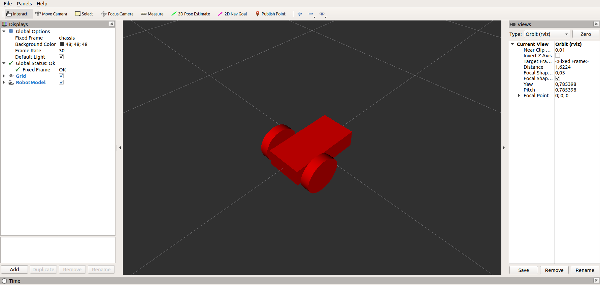
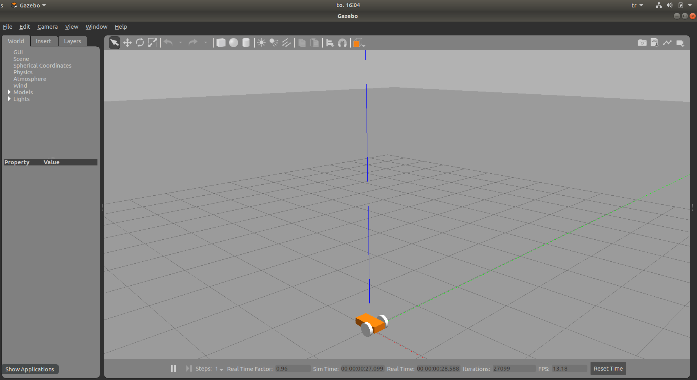
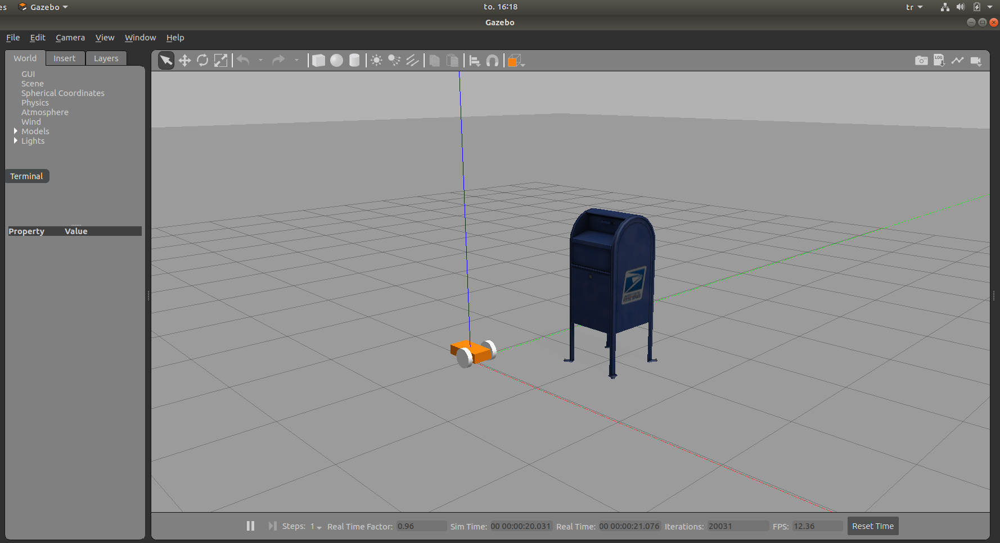
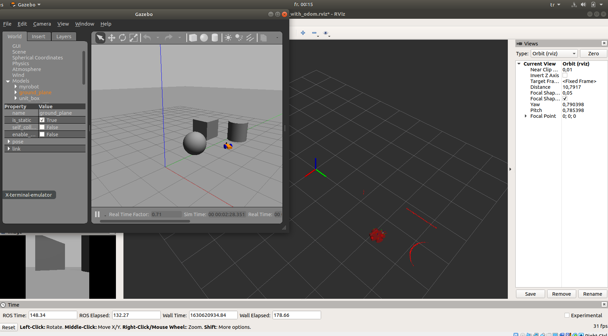

.. _URDF_Gazebo_RViz:

********************************************
Simulation and Visualization Robots in ROS
********************************************
Robot model is described in `URDF <http://wiki.ros.org/urdf/Tutorials/>`_ format in ROS. There are 2 main simulation tools in the ROS environment to visualize your robot: `Rviz <http://wiki.ros.org/rviz>`_ and `Gazebo <http://gazebosim.org/tutorials?tut=ros_overview>`_. Even though they both are simulation tools, they diverge when it comes to usage. Rviz is more *visualization* purposes such that map creation, transfer function visualization, point cloud, image visualization etc. Gazebo, on the other hand, is used for physical testing. Despite the fact that it is possible to test sensor readings on Rviz as well, it is not possible to test collisions in Rviz; you need Gazebo (or another physics engine embedded simulation tools.

.. warning::
   Before moving on, I would like you all to have the same folder organization as shown in the figure. This is important for you to follow the rest of the tutorial easily. Although such an organization is not necessarry for ROS system particularly, this is the accepted/official way of organizing ROS packages.

   .. code::

      cd ~/catkin_ws/src  # change directory into source folder in our catkin workspace
      catkin_create_pkg gazebo_tutorials rospy geometry_msgs urdf  # create new package
      cd ..  # change directory to where /src folder located
      catkin_make  # build packages
      source devel/setup.bash  # Tell Linux that we have new built packages there
      rospack profile  # Tell ROS that we have new packages and update the list

   And create necessary folders in our new package:

   .. code::

      roscd gazebo_tutorials
      mkdir config launch meshes src urdf worlds

   End result should look like that:

   .. figure:: ../_static/images/folders.png
          :align: center

.. _URDF-Tutorial:

URDF Tutorial
==============
Unified Robot Description Format. It is used to describe the robot model. It contains links, joints and basic material information of each part of the robot. You can follow the `list of parts <http://wiki.ros.org/urdf/Tutorials/Building%20a%20Visual%20Robot%20Model%20with%20URDF%20from%20Scratch>`_ is the R2D2 model written in URDF!

All the elements that you can use in an URDF file are `these. <http://wiki.ros.org/urdf/XML/robot>`_ A simple URDF file looks like this. Let's first understand it line by line.

 .. literalinclude:: ../_static/scripts/simplexacro.xacro
       :language: xml
       :caption: A simple URDF

A diferential drive mobile robot model can be modeled in URDF format. Here is a custom differential robot. The robot model is inspired from `MooreRobots website <http://moorerobots.com/blog>`_.

 .. literalinclude:: ../_static/scripts/gazebo_tutorials/urdf/my_robot_simple.xacro
       :language: xml
       :caption: gazebo_tutorials/urdf/my_robot_simple.xacro

Please keep an attention that we haven't defined any *physical* properties of the robot such as its weight, material properties, color etc. This simple URDF model contins only the *visual* features of the robot.

URDF in RViz
-------------

If we want to visualize it, then we need to use RViz:

 .. literalinclude:: ../_static/scripts/gazebo_tutorials/launch/my_rviz_simple.launch
       :language: xml
       :caption: gazebo_tutorials/launch/my_robot_rviz_simple.launch

RViz is a useful tool if you want to visualize sensor data, transformation and so on. However, it does not give you any default information about collisions and any physical property requiring information. You need Gazebo to *simulate* your robot and environment.

When you hit Ctrl+S, you can save the current configuration of your RViz and therefore you don't need to add all tools you are using every single time you run your launch file. Be careful! You might be saving into the default configuration of RViz - this is probably not you want. The code piece is saving the configuration in /config folder with a name *rviz_config.rviz*

URDF in Gazebo
----------------

URDF files are able to be used in Gazebo by including mass, inertia, joint efforts, joint limits etc properties of the links and joint. In fact, Gazebo simulator does not use the URDF files directly. The file format in which Gazebo uses is SDF (Simulation Description Format). The main reason is that the URDF files are lacking many features and have not been updated to deal with the evolving needs of robotics. URDF can only specify the kinematic and dynamic properties of a single robot in isolation. URDF can not specify the pose of the robot itself within a world. It is also not a universal description format since it cannot specify joint loops (parallel linkages), and it lacks friction and other properties. Additionally, it cannot specify things that are not robots, such as lights, heightmaps, etc.

However, at this moment, there is no need to frustrate with a new file format than URDF yet it is nice to know this fact. For more detailed information, you can `read this <http://gazebosim.org/tutorials?tut=ros_urdf>`_.

.. note::
   With the current URDF model we cannot visualize our robot in Gazebo because we haven't defined any physical properties. We need to improve the URDF model by adding some ``<collision/>`` and ``<inertial/>`` properties. Since the main purpose of this lecture *is not* to teach *how to create a URDF file*, you can just `download the additional folders (config, meshes, urdf) <https://hvl365.sharepoint.com/:f:/s/RobotikkUndervisningHVL/Ek18x5CSJ5hGpmzpUYvXjhsBtEn21aQ3xPPS-svjxkPcpQ?e=NChLd9>`_ in the **gazebo_tutorials** package and keep following rest of the tutorial.
   
   
.. _Gazebo-Tutorial:

Gazebo Tutorial
=================
Gazebo is the most used simulator in ROS. It has integrated physics rules like gravity, colision, light distribution with reflection and refraction properties, mass and inertia etc. Now, we will see how to set the Gazebo for a very basic usage.

.. figure:: ../_static/images/mybot.png
          :align: center

          Source: moorerobots.com

.. note::
   Gazebo is a standalone simulation tool with its own physics engine. It does not require ROS to run.

First, we need a *world* where we spawn our robot. Let's create an empty world in the /world folder:

.. literalinclude:: ../_static/scripts/gazebo_tutorials/worlds/my_world.world
      :language: xml
      :caption: gazebo_tutorials/worlds/my_world.world

Now we can spawn our robot in Gazebo in this custom world. For that, we need to create a launch file:

.. literalinclude:: ../_static/scripts/gazebo_tutorials/launch/my_gazebo.launch
      :language: xml
      :caption: my_gazebo.launch

At the end you should be able to see this:

Currently, the world is empty and meaningless (*smile here*). We can add lots of predefined or custom models into our world.

Adding Gazebo Models
----------------------
We can add some items by just adding items as we included the *sun* and the *ground plane* into our world file. There are many ready-to-use models in the official `gazebo-models repository <https://github.com/osrf/gazebo_models>`_. Now, choose a model and as in the following code.

.. code-block:: xml

   <!-- Add an object -->
	<include>
	  <uri>model://postbox</uri>
	</include>

.. warning::
   If you experience **[Err] [REST.cc:205] Error in REST request** error and cannot spawn a new oject, please use `this workaround <[Err] [REST.cc:205] Error in REST request>`_.

Also you can change the position and orientation of any object which you have added with the :code:`<pose>x y z roll pitch yaw</pose>` tag.

.. note::
   The ``<uri/>`` tag searches the model names in the website `http://models.gazebosim.org <http://models.gazebosim.org>`_, which is stored in the environment variable ``GAZEBO_MODEL_DATABASE_URI`` and local models are stored in ``~/.gazebo/models/`` path. If you want to create a custom model, then you need to create a model folder under that folder. A custom model folder must contain a *model.sdf* and a *model.config*  as shown in figure below. More detailed information can be founf in `make a model tutorial <http://gazebosim.org/tutorials?tut=build_model>`_.

   .. figure:: ../_static/images/ros/custom-model.png
          :align: center

Adding Controllers and Sensors (part 2)
-----------------------------------------
We are going to add a differential drive controller, camera and a laser scanner on our 2 wheel robot.

This part is a bit more complicated to describe each detail in such a short time. Therefore, we provide you the necessary template files, go throught the process and focus only on the key points so that you can use them if you need in your project.

When you want to add a feature on your robot in Gazebo (a controller or sensor), you need to use `Gazebo plugins <http://gazebosim.org/tutorials?tut=ros_gzplugins>`_. We introduce two plugins in our ``my_robot.gazebo`` file. You will see that there is already a controller plugin on which we didn't focus too much. That plugin is to drive the simulated robot. Now we introduce the sensor plugins:

.. code-block:: xml

  <!-- Camera Plugin-->
  <gazebo reference="camera">
    <material>Gazebo/Green</material>
    <sensor type="camera" name="camera1">
      <update_rate>30.0</update_rate>
      <camera name="head">
        <horizontal_fov>1.3962634</horizontal_fov>
        <image>
          <width>800</width>
          <height>800</height>
          <format>R8G8B8</format>
        </image>
        <clip>
          <near>0.02</near>
          <far>300</far>
        </clip>
      </camera>
      <plugin name="camera_controller" filename="libgazebo_ros_camera.so">
        <alwaysOn>true</alwaysOn>
        <updateRate>0.0</updateRate>
        <cameraName>mycamera</cameraName>
        <imageTopicName>image_raw</imageTopicName>
        <cameraInfoTopicName>camera_info</cameraInfoTopicName>
        <frameName>camera</frameName>
        <hackBaseline>0.07</hackBaseline>
        <distortionK1>0.0</distortionK1>
        <distortionK2>0.0</distortionK2>
        <distortionK3>0.0</distortionK3>
        <distortionT1>0.0</distortionT1>
        <distortionT2>0.0</distortionT2>
      </plugin>
    </sensor>
  </gazebo>
  
  
  <!-- Laser Scanner Plugin-->
  <gazebo reference="hokuyo">
    <sensor type="ray" name="head_hokuyo_sensor">
      <pose>0 0 0 0 0 0</pose>
      <visualize>false</visualize>
      <update_rate>40</update_rate>
      <ray>
        <scan>
          <horizontal>
            <samples>720</samples>
            <resolution>1</resolution>
            <min_angle>-1.570796</min_angle>
            <max_angle>1.570796</max_angle>
          </horizontal>
        </scan>
        <range>
          <min>0.10</min>
          <max>30.0</max>
          <resolution>0.01</resolution>
        </range>
        <noise>
          <type>gaussian</type>
          <!-- Noise parameters based on published spec for Hokuyo laser
               achieving "+-30mm" accuracy at range < 10m.  A mean of 0.0m and
               stddev of 0.01m will put 99.7% of samples within 0.03m of the true
               reading. -->
          <mean>0.0</mean>
          <stddev>0.01</stddev>
        </noise>
      </ray>
      <plugin name="gazebo_ros_head_hokuyo_controller" filename="libgazebo_ros_laser.so">
        <topicName>/myscan</topicName>
        <frameName>hokuyo</frameName>
      </plugin>
    </sensor>
  </gazebo>

You don't need to copy-paste any part of this code piece. It is already available in ``my_robot_with_sensor.gazebo`` which is included in our advanced URDF robot model ``my_robot_with_sensor.xacro`` in the \urdf folder.

Now we can spawn the new robot model in the Gazebo with the following lauch file:

.. literalinclude:: ../_static/scripts/gazebo_tutorials/launch/my_gazebo_with_sensor.launch
      :language: xml
      :caption: gazebo_tutorials/launch/my_gazebo_with_sensor.launch

At this point, we can either start an empty RViz ``rosrun rviz rviz`` and add the necessary visualization tools in it or you can use the following launch file to staer everything we did so far:

.. literalinclude:: ../_static/scripts/gazebo_tutorials/launch/my_robot_allinone.launch
      :language: xml
      :caption: gazebo_tutorials/launch/my_robot_allinone.launch

About ROS Controllers
------------------------

.. seealso::

   There are various controller types in ``ros_control``. Depending on the requirement of your robot, you can choose your controller. Since ros_control is a whole world itself, we are not going to get into details in the scope of this course. If you are interested you can visit the `ros_control wiki page <http://wiki.ros.org/ros_control>`_, `ros_control tutorials <http://wiki.ros.org/ros_control/Tutorials>`_, and the `gazebo_ros_control tutorials <http://gazebosim.org/tutorials/?tut=ros_control>`_ (if you are not using a real robot).

TF Tutorial
============
TF is a powerful in ROS to define relative poses of robots and objects in an environment. If you add an **axis** using the toolbar in RViz and select ``\odom`` frame, and moving the robot, you can see how much you travelled from the odom_fixed frame. You can select any frame!

To move your robot:

.. code::

   rostopic pub /myrobot/cmd_vel geometry_msgs/Twist "linear:
    x: 0.3
    y: 0.0
    z: 0.0
  angular:
    x: 0.0
    y: 0.0
    z: 0.3" 

The end result should look like this:

You can observe all available frames with:

.. code::
   
   rosrun tf view_frames
   xdg-open frames.pdf

To observe any frame with respect to any other frame either:

.. code::

   rosrun tf tf_echo /odom /chassis

   # OUTPUT:
    At time 189.812
    - Translation: [0.000, -0.002, 0.100]
    - Rotation: in Quaternion [0.000, -0.000, -0.005, 1.000]
                in RPY (radian) [0.000, -0.000, -0.010]
                in RPY (degree) [0.000, -0.000, -0.576]
                
or just echo the ``/tf`` topic:

.. code::

   rostopic echo /tf

   # OUTPUT
   transforms: 
    - 
      header: 
        seq: 0
        stamp: 
          secs: 240
          nsecs: 767000000
        frame_id: "odom"
      child_frame_id: "chassis"
      transform: 
        translation: 
          x: 5.11669168712e-05
          y: -0.00200111565063
          z: 0.100000018101
        rotation: 
          x: 4.00798431438e-07
          y: -8.38327727537e-07
          z: -0.00605816608889
          w: 0.999981649143

