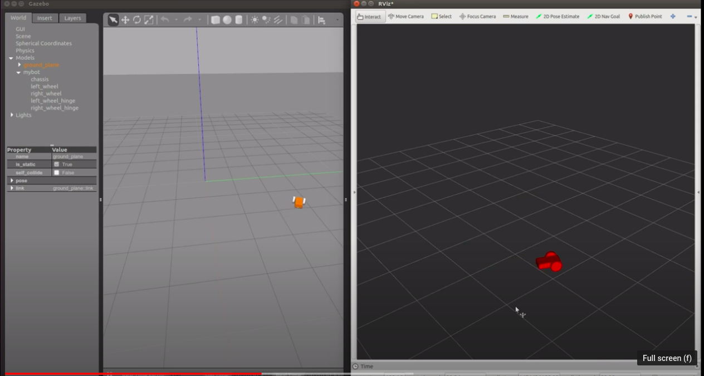
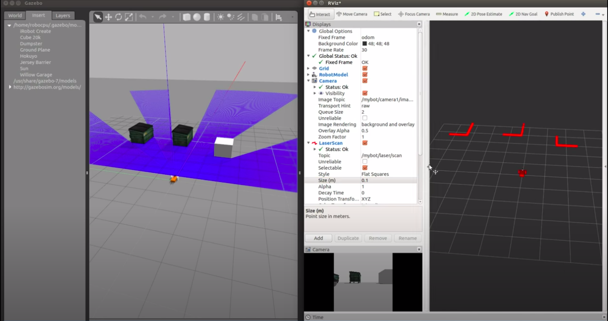

**********************************
Gazebo (RViz) TF URDF MATLAB
**********************************

As we talked, there are 2 main simulation tools in the ROS environment. `Rviz <http://wiki.ros.org/rviz>`_ and `Gazebo <http://gazebosim.org/tutorials?tut=ros_overview>`_. Even though they both are simulation tools, they diverge when it comes to usage. Rviz is more *visualization* purposes such that map creation, transfer function visualization, point cloud, image visualization etc. Gazebo, on the other hand, is used for physical testing. Despite the fact that it is possible to test sensor readings on Rviz as well, it is not possible to test collisions in Rviz; you need Gazebo (or another physics engine embedded simulation tools.

.. _Gazebo-Tutorial:

Gazebo Tutorial
=================

Here is a custom differential robot. See the original tutorial from `MooreRobots website <http://moorerobots.com/blog>`_.

          Source: moorerobots.com

.. note::
   Gazebo is a standalone simulation tool with its own physics engine. It does not require ROS to run.

Gazebo is the most used simulator in ROS. It has integrated physics rules like gravity, colision, light distribution with reflection and refraction properties, mass and inertia etc. Now, we will see how to set the Gazebo for a very basic usage.

.. warning::
   Before moving on, I would like you all to have the same folder organization as shown in the figure. This is important for you to follow the rest of the tutorial easily. Although such an organization is not necessarry for ROS system particularly, this is the accepted/official way of organizing ROS packages.

   .. figure:: ../_static/images/folders.png
          :align: center

First, let's create an empty world under the /world folder.

.. literalinclude:: ../_static/scripts/empty_world.world
      :language: xml
      :caption: empty_world.world

Secondly, create a launch file under /launch folder to run Gazebo and import our empty world.

.. literalinclude:: ../_static/scripts/my_world_gazebo.launch
      :language: xml
      :caption: my_world_gazebo.launch

Adding Gazebo Models
----------------------

We can add some items by just adding items as we included the *sun* and the *ground plane* into our world file. There are many ready-to-use models in the official `gazebo-models repository <https://github.com/osrf/gazebo_models>`_. Now, choose a model and as in the following code.

.. code-block:: xml

   <!-- Add an object -->
	<include>
	  <uri>model://postbox</uri>
	</include>

Also you can change the position and orientation of any object which you have added with the :code:`<pose>x y z roll pitch yaw</pose>` tag.

.. note::
   The ``<uri/>`` tag searches the model names in the website `http://models.gazebosim.org <http://models.gazebosim.org>`_, which is stored in the environment variable ``GAZEBO_MODEL_DATABASE_URI`` and local models are stored in ``~/.gazebo/models/`` path. If you want to create a custom model, then you need to create a model folder under that folder. A custom model folder must contain a *model.sdf* and a *model.config*  as shown in figure below. More detailed information can be founf in `make a model tutorial <http://gazebosim.org/tutorials?tut=build_model>`_.

   .. figure:: ../_static/images/ros/custom-model.png
          :align: center

Adding Sensors to the Gazebo Model (part 2)
---------------------------------------------
Adding scanner and some obstacles on our 2 wheel robot. It is going to look like this:

This part is going to be a homework. The tutorial is `in this link <https://www.youtube.com/watch?v=EZ3MYf24c6Y&list=PLTEmcYHVE7dPWixFnzkd68jPjwGzxHjUG&index=2&ab_channel=RichardWang>`_.

.. _URDF-Tutorial:

URDF Tutorial
==============
Unified Robot Description Format. It is used to describe the robot model. It contains links, joints and basic material information of each part of the robot. You can follow the `list of parts <http://wiki.ros.org/urdf/Tutorials/Building%20a%20Visual%20Robot%20Model%20with%20URDF%20from%20Scratch>`_ is the R2D2 model written in URDF!

All the elements that you can use in an URDF file are `these. <http://wiki.ros.org/urdf/XML/robot>`_ A simple URDF file looks like this. Let's first understand it line by line.

 .. literalinclude:: ../_static/scripts/simplexacro.xacro
       :language: xml

URDF in RViz
-------------

 .. literalinclude:: ../_static/scripts/my_robot.xacro
       :language: xml
       :caption: beginners_tutorials/urdf/my_robot.xacro

 .. literalinclude:: ../_static/scripts/my_robot_rviz.launch
       :language: xml
       :caption: beginners_tutorials/launch/my_robot_rviz.launch

URDF in Gazebo
----------------

URDF files are able to be used in Gazebo by including mass, inertia, joint efforts, joint limits etc properties of the links and joint. In fact, Gazebo simulator does not use the URDF files directly. The file format in which Gazebo uses is SDF (Simulation Description Format). The main reason is that the URDF files are lacking many features and have not been updated to deal with the evolving needs of robotics. URDF can only specify the kinematic and dynamic properties of a single robot in isolation. URDF can not specify the pose of the robot itself within a world. It is also not a universal description format since it cannot specify joint loops (parallel linkages), and it lacks friction and other properties. Additionally, it cannot specify things that are not robots, such as lights, heightmaps, etc.

However, at this moment, there is no need to frustrate with a new file format than URDF yet it is nice to know this fact. For more detailed information, you can `read this <http://gazebosim.org/tutorials?tut=ros_urdf>`_.

Xacro: beginners_tutorials/urdf/mybot/mybot.xacro :code:`git clone -b base https://github.com/richardw05/mybot_ws.git`

 .. literalinclude:: ../_static/scripts/my_robot_gazebo.launch
       :language: xml
       :caption: beginners_tutorials/launch/my_robot_gazebo.launch

..
  Here is the `youtube tutorial of Moore robots <https://www.youtube.com/watch?v=8ckSl4MbZLg&list=PLTEmcYHVE7dPWixFnzkd68jPjwGzxHjUG>`_.

TF Tutorial
============
The `original tutorial <http://wiki.ros.org/tf/Tutorials/Introduction%20to%20tf>`_ is linked. Let's modify this to understand Rviz elements a bit more. First start the node with two turtles with the following command: :code:`roslaunch turtle_tf turtle_tf_demo.launch`.

Start Rviz: :code:`rosrun rviz rviz`.

As you see, there is no element on the left toolbar. First add the :code:`/world` frame. Also add the TF element.

Click on the terminal again, use your arrow keys to move your turtle and observe the TF poses on Rviz.